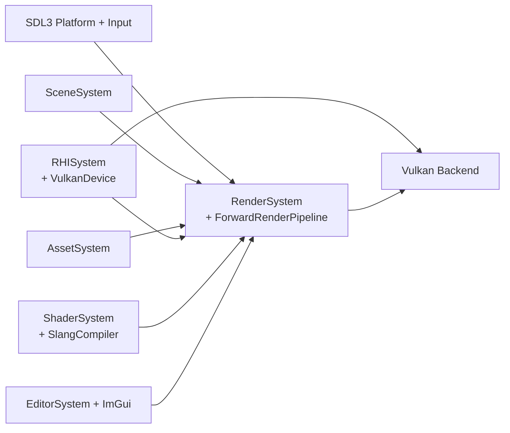
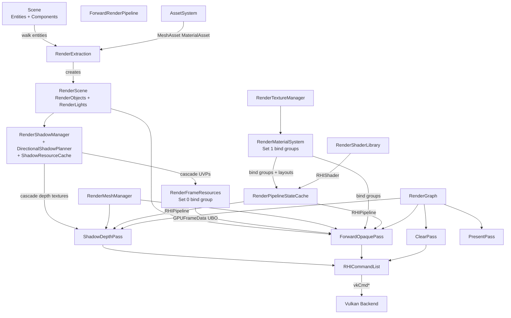

# 00 Engine Overview

## 1. Project Goal

XEngine is a learning-oriented, architecture-conscious C++20 game engine whose target
production ceiling is "future RenderGraph V1, RenderFeature, CSM, IBL, TAA, GPUScene,
ray tracing, editor tools". The codebase is intentionally modular so that new render
features can be added without restructuring ownership boundaries.

It is not yet a production engine. The current focus is to consolidate the first
working set of subsystems (Core / Math / Asset / Scene / RHI / Renderer / Editor /
Sandbox) and to remove or finalize stub layers rather than to add features.

## 2. Current Stage

The engine is past the "Forward Renderer + PBR + CSM" milestone and currently in
"RenderGraph V0 / linear / unaliased" stage. Cascaded Shadow Maps produce real GPU
resources and an Execute-side `ShadowDepthPass`, but the shadow data is consumed
as `lightDir + shadow factor` and not yet unified into a full forward+lighting
loop beyond a per-light factor read.

Editor and Sandbox compile, run, and present a single Vulkan-backed window. The
Sandbox loads `Default.xscene`, the Editor adds an `EditorSystem` and an ImGui overlay.

## 3. Module List

CMake groups (`Engine/CMakeLists.txt`):

| CMake group | Library target | Role |
|---|---|---|
| `Engine/Source/Foundation` | `XEngineFoundation` (Core + Logging + Math + Diagnostics) | Engine-agnostic C++20 utilities, math aliasing, logging, asserts. |
| `Engine/Source/Runtime/Engine` | `XEngineCoreRuntime` | Engine class, SubsystemManager, Time, main loop scheduling. |
| `Engine/Source/Runtime/Serialization` | `XEngineSerialization` | JSON read/write, version macros, context struct. |
| `Engine/Source/Runtime/FileSystem` | (merged into Core) | Filesystem helpers, VFS. |
| `Engine/Source/Runtime/Asset` | `XEngineAsset` | Asset metadata, CPU-side texture / mesh / material records, glTF importer. |
| `Engine/Source/Runtime/Input` | `XEngineInput` | SDL3-backed input subsystem. |
| `Engine/Source/Runtime/Scene` | `XEngineScene` | Entity, Scene, components, hierarchy, TransformSystem, DebugCameraController, SceneSerializer. |
| `Engine/Source/Runtime/Platform` | `XEnginePlatform` | SDL3 window + platform abstraction. |
| `Engine/Source/Runtime/Shader` | `XEngineShader` | ShaderCompiler abstract + SlangCompiler, ShaderModule, ShaderSystem. |
| `Engine/Source/Runtime/RHI` | `XEngineRHI` | Backend-agnostic RHI abstractions. Vulkan backend in `Private/Vulkan`. |
| `Engine/Source/Runtime/Renderer` | `XEngineRenderer` | RenderSystem, ForwardRenderPipeline, passes, resource managers, shadow subsystem. |
| `Engine/Source/Editor` | `XEngineEditor` (optional) | EditorApplication, EditorSystem, ImGui-driven panels. |
| `Apps/Sandbox` | `XEngineSandbox` | Headless loop loading `Default.xscene`. |
| `Apps/EditorApp` | (executable target) | Wires Editor and Engine together. |
| `ThirdParty/` | various `XEngine*`-prefixed targets | SDL3, glm, spdlog, fastgltf, slang, volk, VMA. |

A single interface target `XEngineRuntime` (`Engine/CMakeLists.txt`) aggregates the
runtime libraries so apps only need to link against one target.

## 4. Dependency Direction

Allowed (read-implemented, not proposing):

```text
App -> Renderer + Scene + Asset + RHI + Foundation + Editor
Editor -> Runtime (interface)
Sandbox -> Runtime (interface)
Renderer -> Scene + Asset + RHI + Foundation
Scene -> Foundation + Math + Asset (only via AssetHandle metadata; never RHI/Renderer)
Asset -> Foundation + Math + Serialization
RHI -> Foundation (no gameplay concepts)
Shader -> Foundation
Serialization -> Foundation
Platform -> Foundation
```

Forbidden:

- Scene, Asset, Foundation -> Renderer, RHI, Vulkan, Slang, fastgltf, stb.
- Renderer exposing `Vk*` types or other RHI-backend-native handles in its public
  headers (only `RHITexture*`, `RHIBindGroup*`, etc. are exposed).
- Editor -> Sandbox.
- Sandbox -> Editor.
- Runtime -> Editor.

See `Docs/Architecture/01_Module_Dependency_Rules.md` for the full matrix.

## 5. Runtime Data Flow



Engine subsystems registered in order (`Engine.cpp:48-71`):
`PlatformSystem -> InputSystem -> ShaderSystem -> AssetSystem -> SceneSystem
-> RHISystem -> RenderSystem -> [app extras, e.g. EditorSystem]`.

## 6. Renderer Data Flow



## 7. Key Design Principles

1. **Ownership clarity.** Renderer-owned data has a single owner (RenderSystem
   holds all managers as `unique_ptr`); Asset owns CPU-side records; Scene owns
   entity/component state; RHI owns GPU primitives.
2. **Pimpl + Handle decoupling.** Heavy renderer managers expose `Handle` types
   (`TextureHandle`, `MeshHandle`, `MaterialHandle`) that index into storage owned
   by the manager.
3. **Backend isolation.** Vulkan types live exclusively under
   `RHI/Private/Vulkan/`. Public RHI types are backend-agnostic.
4. **Validate, then lazy.** Vulkan validation layers are enabled by default
   (`RHISystem.cpp:69`). Shader reflection happens lazily via Slang once per
   `(path, entry, stage, target)` tuple.
5. **No Vulkan in headers.** All Vulkan handle ownership lives in cpp files; the
   only public escape valve is `VulkanNativeContext` queried through the device
   (`RHIDevice.h`). Same applies to editor-internal input/output surfaces.
6. **Engine coordinates; subsystems cooperate.** `RenderSystem::Impl` does *not*
   do its own scene walking, GPU work, or shader compilation - it composes
   subsystems and bridges them via a small per-frame payload.

## 8. Implementation Status

Implemented:

- C++20 core, log, assert, types (`Foundation/Core`).
- Math aliases and helpers (`Foundation/Math`).
- SDL3 platform + input.
- Asset system with mesh / texture / material records and glTF import.
- Scene + components + hierarchy + transform system.
- Serialization (JSON).
- Vulkan-backed RHI: device, queue, swapchain, surface, command pool,
  descriptor pool, upload manager, pipelines, shaders, textures, samplers.
- Dynamic rendering (`VK_KHR_dynamic_rendering`,
  `VK_KHR_shader_draw_parameters`).
- Slang-based shader compilation with cache under `Saved/Cache`.
- Forward Renderer with ForwardOpaquePass + ClearPass + PresentPass +
  ShadowDepthPass.
- Cascaded Shadow Maps: shadow resource cache, directional planner, per-cascade
  depth view, freeze debug mode.
- Frame resources (Set 0: GPUFrameData UBO + shadow sampled view + sampler) with
  per-frame-in-flight indexing claim (constant `RendererMaxFramesInFlight = 3`).
- Editor with ImGui panels + docking + EditorApplication.
- Sandbox running `Default.xscene`.

Partially Implemented / Placeholder:

- `RenderGraph` is V0/linear (`RenderGraph.cpp`); only setup lambdas run, no
  topological analysis or resource aliasing.
- `VulkanFrameResources` constant `MaxFramesInFlight = 1` exists but the
  Vulkan backend allocates one fence + per-image semaphore array (effectively
  one in-flight at the CPU/GPU sync boundary). The Renderer and RHI constants
  disagree - see `07_Frames_In_Flight_And_GPU_Synchronization.md`.
- `RenderFrameResources::SetShadowBindings` carries an unused
  `reinterpret_cast<std::uintptr_t>` debug print that should be removed.
- `VulkanSwapchain.cpp` swapchain recreation reuses pre-existing image handles
  when image count does not change, but does not currently resize the
  per-image render-finished semaphore array if it differs.
- `RendererMaxFramesInFlight = 3` claim in `RenderFrameResources.h` vs the
  RHI-side `MaxFramesInFlight = 1`.

Planned / Not Yet Implemented:

- TAA, IBL, GPUScene, ray tracing.
- Bindless / descriptor arena.
- Async compute.
- DebugDraw.
- RenderGraph V1 (topology, aliasing, culling).
- IBL specular + diffuse cubemap probes.
- Skeletal animation + skinning.
- SceneAsset + editor save/load round-trip.

## 9. Major Current Limitations

- **One in-flight frame on Vulkan side.** CPU blocks on fence inside
  `VulkanDevice::BeginFrame`; the renderer claim of "3 frames in flight" is
  not enforced by the GPU sync layer.
- **Render pass coverage.** Only `ShadowDepth` and `ForwardOpaque` execute real
  work; `Present` is a no-op (real present happens inside `RHIDevice::EndFrame`).
  Several class-style passes (`SkyboxPass`, `TonemapPass`, `DepthPrePass`,
  `ForwardPass`, `ForwardMeshPass`, `TrianglePass`) exist as files but are
  either empty stubs or not wired into the live pipeline.
- **No global error policy** in the RHI. Failure to create a device / queue /
  swapchain returns `bool`/`VkResult`; many paths log and continue.
- **Editor uses Vulkan overlay** through `RHIDevice::RenderVulkanOverlay`,
  which currently requires a Vulkan handle to be passed in.

## 10. Next Stage Direction

Recommended next milestones (in priority order, derived from existing code state):

1. Reconcile the frames-in-flight constant (move `RendererMaxFramesInFlight = 3`
   to be honored by the RHI backend, or relax to `1`).
2. Decide which of the six dead pass files should be removed versus scheduled
   for a near-term stage (Skybox / Tonemap are real upcoming features, the rest
   are obsolete).
3. Render-system boundary cleanup: extract view/projection building from
   `RenderSystem::Render` into a `Camera::BuildViewProjection` helper, isolate
   `TransitionTextureToShaderRead` at the pipeline/output boundary.
4. Move from RenderGraph V0 to a real pass graph (after current forward pipeline
   stabilizes), driven by the existing `RenderGraphBuilder` API and its TODO
   comments.
5. Editor-side save/load that round-trips through `SceneSerializer`.

## 11. Source References

- `Engine/CMakeLists.txt` - module aggregation and the `XEngineRuntime` interface target.
- `Engine/Source/Runtime/Engine/Public/XEngine/Engine/Engine.h` - `Engine` class.
- `Engine/Source/Runtime/Engine/Private/Engine.cpp:48-71` - subsystem creation order.
- `Engine/Source/Runtime/Renderer/Private/RenderSystem.cpp:131-284` - per-frame `Render()`.
- `Engine/Source/Runtime/Renderer/Private/RenderSystem.cpp:297-397` - subsystem wiring order.
- `Engine/Source/Runtime/RHI/Private/Vulkan/VulkanDevice.cpp` - Vulkan device lifecycle, sync primitives.
- `Engine/Source/Runtime/RHI/Private/RHIDevice.cpp:69` - validation layer toggle.
