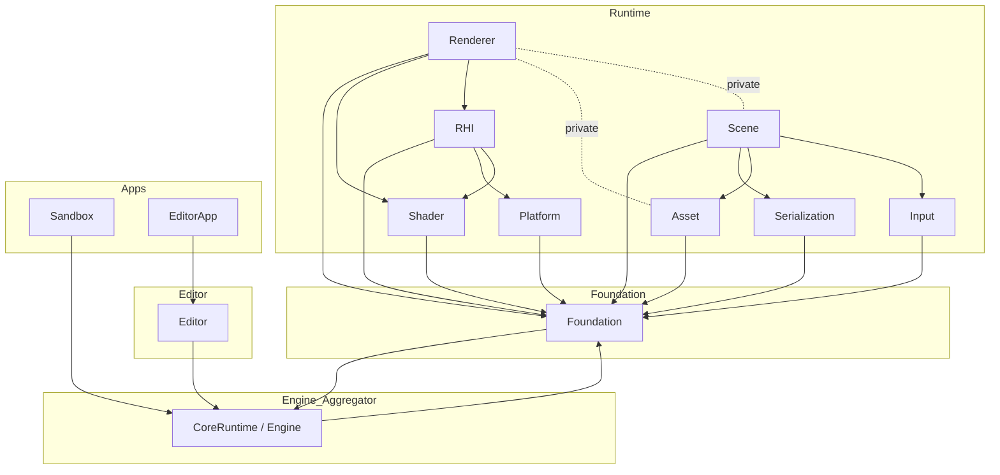
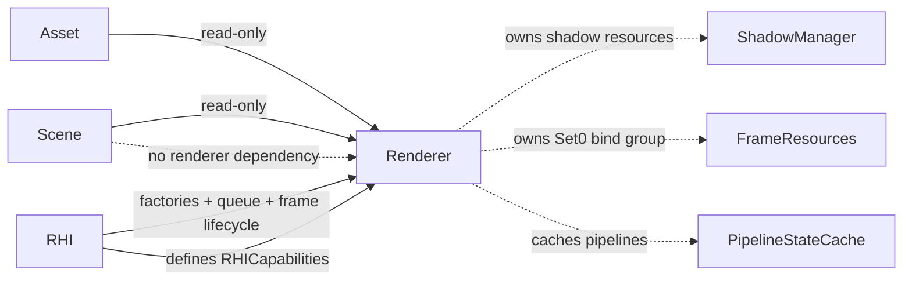

# 01 Module Dependency Rules

## 1. Module Set

Compiled CMake targets (from `Engine/CMakeLists.txt`):

| Target | Source root | Notes |
|---|---|---|
| `XEngineFoundation` | `Engine/Source/Foundation/{Core,Diagnostics,Logging,Math}` | Leaf module. |
| `XEngineCoreRuntime` | `Engine/Source/Runtime/Engine` | Includes headers of every other Runtime module via include-path tricks. |
| `XEngineSerialization` | `Engine/Source/Runtime/Serialization` | JSON, version, context. |
| `XEngineAsset` | `Engine/Source/Runtime/Asset` | Asset records + glTF importer. |
| `XEngineInput` | `Engine/Source/Runtime/Input` | SDL3 input. |
| `XEnginePlatform` | `Engine/Source/Runtime/Platform` | SDL3 window + platform abstraction. |
| `XEngineShader` | `Engine/Source/Runtime/Shader` | Slang-backed shader system. |
| `XEngineRHI` | `Engine/Source/Runtime/RHI` | RHI abstractions + Vulkan backend. |
| `XEngineScene` | `Engine/Source/Runtime/Scene` | Scene, components, transform system, scene serializer. |
| `XEngineRenderer` | `Engine/Source/Runtime/Renderer` | RenderSystem, pipeline, passes, shadow subsystem. |
| `XEngineEditor` (optional) | `Engine/Source/Editor` | ImGui-driven editor library. |
| `XEngineRuntime` | (INTERFACE) | Aggregate interface that depends on every runtime target above. |
| `XEngineSandbox` | `Apps/Sandbox` | Headless demo linking `XEngineRuntime`. |
| `XEngineEditorApp` | `Apps/EditorApp` | Editor entry-point executable linking `XEngineEditor`. |

## 2. Allowed Dependency Directions

Notes from CMake:

- `XEngineRenderer` declares `XEngineShader` and `XEngineRHI` PUBLIC (`Engine/CMakeLists.txt`), and `XEngineAsset` / `XEngineScene` PRIVATE.
- `XEngineScene` depends on `XEngineSerialization`, `XEngineAsset`, `XEngineInput` publicly.
- `XEngineRHI` adds Vulkan includes via `TargetIncludeDirectories` only when `XENGINE_ENABLE_VULKAN=ON`.

## 3. Forbidden Dependency Directions

| From | To | Reason |
|---|---|---|
| `XEngineFoundation` | Anything except its own sub-modules | Foundation must remain a leaf. |
| `XEngineAsset` | `XEngineRHI`, `XEngineShader`, `XEngineRenderer`, `XEngineScene` | Assets are pure CPU records + glTF data; they must not know the rendering layer exists. |
| `XEngineScene` | `XEngineRHI`, `XEngineRenderer`, `XEngineShader` | Scene is engine-domain and must not depend on rendering. |
| `XEngineRenderer` (public headers) | Vulkan, Slang, fastgltf, stb | Renderer has a stable RHI-facing surface only. |
| Public RHI headers | Vulkan, volk, VMA | RHI public must be backend-neutral. The only exception is `Public/XEngine/RHI/Native/VulkanNativeContext.h` which exposes opaque `uintptr_t` slots (see `Class/VulkanDevice.md`). |
| `XEngineRenderer` | public `Platform`, `Input` | Renderer should not be aware of platform/input subsystems at the public API level. |
| `XEngineEditor` | `XEngineSandbox` | Editor is reusable; Sandbox-specific logic cannot flow up. |
| Runtime modules | `XEngineEditor` | Runtime cannot depend on editor. |

## 4. Public / Private Header Boundaries

### Foundation (`XEngineFoundation`)

- `Public/XEngine/{Core,Logging,Diagnostics,Math}/*.h` — only stable engine-wide types.
- `Private/*.cpp` carries the implementation; no module is allowed to `#include "XEngine/Core/..."` from a `Private/` source of another module.

### Runtime modules

- `Public/XEngine/<Module>/*.h` is the only surface other modules may include.
- `Private/...` is restricted to that module's own translation units and is hidden from the include path.
- Renderer further splits Private by sub-purpose:
  - `Pipeline/` - rendering pipeline base + ForwardRenderPipeline + RenderFrameContext + RenderProjection.
  - `Passes/` - per-pass graph nodes.
  - `Resources/` - texture/mesh/material/pipeline/frame managers.
  - `Scene/RenderExtraction.{h,cpp}` - Scene -> RenderScene bridge.
  - `Shadows/` - shadow subsystem.
  - `RenderGraph/` - graph runtime (currently V0).
  - `ShaderInterop/` - shader-visible structs (e.g. `GPUFrameData`, `GPULightingData`, `GPUShadowData`).
- RHI splits Private by backend:
  - `Vulkan/...` - implementation.
  - `D3D12/`, `Metal/` - empty placeholders reserved for future backends.
  - `Resources/...` - backend-neutral RHI resource cpp shims.

### Vulkan native handle confinement

All `Vk*` types are confined to:

- `Engine/Source/Runtime/RHI/Private/Vulkan/*.h`

The only public escape is `VulkanNativeContext`, declared in
`Public/XEngine/RHI/Native/VulkanNativeContext.h`, which packs handles into opaque
`std::uintptr_t` fields. See `Class/VulkanDevice.md` for the escape contract.

## 5. Third-party Isolation Rules

- Vulkan: only allowed under `Engine/Source/Runtime/RHI/Private/Vulkan/` and `Engine/Source/Runtime/RHI/Public/XEngine/RHI/Native/VulkanNativeContext.h`.
- Slang: only allowed under `Engine/Source/Runtime/Shader/Private/Slang/`.
- fastgltf and stb: only allowed under `Engine/Source/Runtime/Asset/Private/Importers/`. Their headers must not escape into `Asset/Public/`.
- SDL3: only allowed under `Engine/Source/Runtime/Platform/Private/SDL/` and `Engine/Source/Runtime/Input/`. SDL3 may appear in RHI's Vulkan backend because `VulkanSurface::GetRequiredInstanceExtensions()` reads SDL's `SDL_Vulkan_GetInstanceExtensions` output (`VulkanSurface.cpp`).
- glm, spdlog: declared PUBLIC/PRIVATE inside `XEngineFoundation` CMakeLists. Transitive includes are tolerated but new modules should not introduce competing math or log libraries.
- ImGui: only allowed in `Engine/Source/Editor/Private/ImGui/`.

## 6. Runtime / Editor / Sandbox Boundary

- `XEngineRuntime` is the public contract for "engine behaviour". Sandbox links it directly; Editor wraps it via `EditorApplication`.
- Editor-specific ImGui, panels, and editor-only commands stay in `XEngineEditor`. They must not appear in `XEngineRuntime` because Sandbox binaries must not pull ImGui.
- Apps must not share code: Sandbox and EditorApp have separate `main.cpp` entry points, separate CMake targets.

## 7. RHI / Renderer / Scene Boundary

Enforced in the current code:

- Renderer `Private/Pipeline/ForwardRenderPipeline.cpp` and pass files include only `Private/Resources/...`, `Private/Passes/...`, `Private/Pipeline/...`. They do not include `Scene/*.h`.
- All Scene -> Renderer crossing flows through `RenderExtraction` in `Engine/Source/Runtime/Renderer/Private/Scene/RenderExtraction.cpp`.
- All Asset -> Renderer crossing flows through `RenderTextureManager`, `RenderMeshManager`, `RenderMaterialSystem`. None of these public headers include asset headers.

## 8. Found Dependency Violations / Soft Spots

The following are *not* architecture violations but worth knowing about:

1. `XEngineCoreRuntime` exposes the include directories of every other Runtime module through CMake `target_include_directories` (`Engine/Source/Runtime/Engine/CMakeLists.txt`). This is intentional - it lets any module linking `XEngineCoreRuntime` see the public headers of all sibling Runtime targets - but anyone scanning for "module boundary leaks" will misread it as cross-module include leakage. The actual cross-module dependencies come from CMake `target_link_libraries`, not from include path visibility.
2. `XEngineRenderer` declares `XEngineAsset` and `XEngineScene` PRIVATE. Apps/SDK consumers of the Renderer library cannot include Asset/Scene headers transitively; they have to link those libraries explicitly. This is the correct encapsulation.
3. `VulkanNativeContext.h` is the only Public RHI header that exposes semantically Vulkan-specific data; this is acceptable because the underlying intent is to bridge to the Editor's Vulkan overlay draw path. Consumers that are not Editor should not need to depend on it.
4. The Renderer module's ShaderInterop GPU structs (`GPUShadowData`, `GPUFrameData`) duplicate `struct` definitions in `Engine/Shaders/.../*.slang`. The duplication is intentional - the comment in `Engine/Shaders/Common/Types.slang` states "Must match the C++ GPUFrameData layout." The contract is enforced by the GPU but not by an automated header generator.

## 9. Source References

- `Engine/CMakeLists.txt`
- `Engine/Source/Foundation/CMakeLists.txt`
- `Engine/Source/Runtime/Engine/CMakeLists.txt`
- `Engine/Source/Runtime/RHI/CMakeLists.txt`
- `Engine/Source/Runtime/Renderer/CMakeLists.txt`
- `Engine/Source/Runtime/Scene/CMakeLists.txt`
- `Engine/Source/Runtime/Asset/CMakeLists.txt`
- `Engine/Source/Editor/CMakeLists.txt`
- `Apps/Sandbox/CMakeLists.txt`
- `Apps/EditorApp/CMakeLists.txt`
