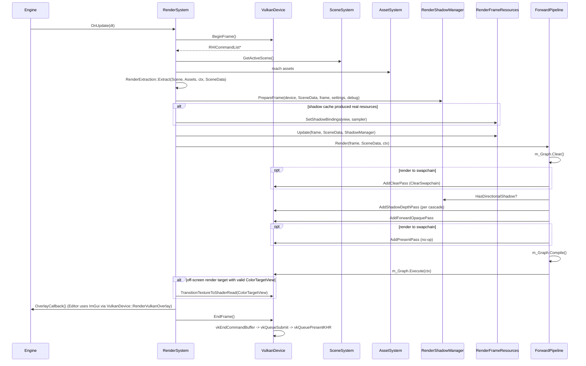
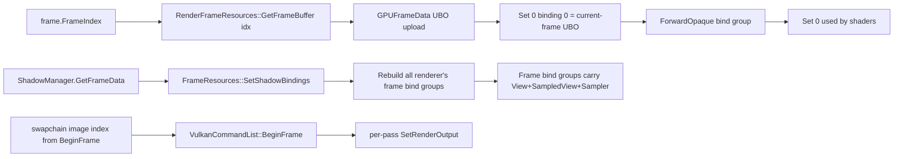

# 02 Frame Runtime Flow

This document describes the actual ordering of operations during one frame of
the Sandbox / Editor apps, derived from the current source code.

## 1. Frame Phases

The Engine class drives three phases per frame (`Engine::Run` ->
`m_SubsystemManager.BeginFrame -> Update -> EndFrame` -
`Engine/Source/Runtime/Engine/Private/Engine.cpp:73-122`):

| Phase | Order | Owner | Source line |
|---|---|---|---|
| BeginFrame | SDL3 poll, Input system tick | `PlatformSystem`, `InputSystem` | `Private/Engine.cpp:75-83` |
| Update | RenderSystem + editor overlay | `RenderSystem::OnUpdate` | `Private/RenderSystem.cpp:410-416` |
| EndFrame | nothing in the Engine loop | (delegated to RHI inside `RenderSystem::Render`) | - |

`RenderSystem::Render(float deltaTime)` (`Private/RenderSystem.cpp:131-284`) is the
guts of the per-frame work and is what we trace below.

## 2. Sequence Diagram

## 3. Phase Details

### 3.1 BeginFrame (VulkanBackend)

`VulkanDevice::BeginFrame` (`RHI/Private/Vulkan/VulkanDevice.cpp:285-362`) performs:

1. Early-out if the device is invalidated or a resize is pending.
2. `vkWaitForFences` against the single in-flight fence (`UINT64_MAX`). This
   makes the per-frame CPU/GPU boundary exactly one frame.
3. `vkAcquireNextImageKHR` with `imageAvailableSemaphore`. The signal index
   into the per-image render-finished semaphore array determines which
   semaphore will be signaled at submit time.
4. `vkResetFences` + `vkResetCommandPool` (the latter resets the single
   command buffer).
5. `vkBeginCommandBuffer` with `VK_COMMAND_BUFFER_USAGE_ONE_TIME_SUBMIT_BIT`.
6. Hand the active command buffer to `VulkanCommandList::BeginFrame` so it can
   reference the current swapchain image, view, extent, and depth attachment.

### 3.2 Scene extraction

`RenderSystem::Render` at line 150-158: `RenderExtraction::Extract` walks every
entity; if the entity has a `MeshRendererComponent` it pulls the matching
`MeshAsset` / `MaterialAsset` from `AssetSystem` and creates an RHI mesh /
material on demand. If it has a `LightComponent` it converts the light type to
a `RenderLightType` and the world-space forward vector to `DirectionToLight`
(`-forward`, negation documented inline at `Private/Scene/RenderExtraction.cpp:111`).

### 3.3 Render output construction

Lines 160-184 of `RenderSystem::Render` build a single `RHIRenderOutputDesc`:

- Default: 0,0 viewport with `SwapchainWidth/SwapchainHeight`, the device's
  swapchain format, depth = `D32Float`, `RenderToSwapchain = true`.
- If `OutputProvider` is set and returns a valid non-zero-size viewport, the
  default is overridden.

The resolved output is then:

- Pushed to the command list via `commandList->SetRenderOutput(output)`.
- Copied into `frame.Output` so passes can reach it through the frame context.

### 3.4 View / projection

Lines 197-254 select a view in this priority order:

1. If `ViewProvider(renderView)` returns true, use `renderView.{View,
   Projection, Position}` and call `ApplyRHIClipSpaceConvention(Projection,
   device->GetClipSpaceConvention())`.
2. Else if `SceneSystem::GetPrimaryCamera()` returns a `CameraComponent` and
   its associated transform, build view from the transform's world position
   and rotation (`Math::BuildViewMatrixLH_XForward`), and build projection
   from `Camera::VerticalFovRadians/NearPlane/FarPlane` (perspective) or
   `OrthographicHeight/NearPlane/FarPlane` (orthographic). Run the result
   through `ApplyRHIClipSpaceConvention`.
3. Else use `FallbackViewProjection` initialized once at
   `RenderSystem::OnCreate`.

### 3.5 Shadow preparation

Line 259 calls `RenderShadowManager::PrepareFrame(device, SceneData, frame,
m_RendererSettings.Shadows, DebugSettings.Shadows)`. Internally:

- `RenderShadowManager::PrepareDirectionalShadow` builds a
  `DirectionalShadowPlanDesc` from the first directional light, the camera
  frustum, scene bounds, and per-cascade settings.
- `m_ResourceCache.GetOrCreateDirectionalShadowResources(desc)` lazily
  allocates the cascade texture array if shape changed.
- `m_DirectionalPlanner.BuildPlan(planDesc, m_FrameData.Directional)`
  produces per-cascade `LightView/LightProjection/LightViewProjection`.

### 3.6 Shadow bind-group rebind

Lines 265-270: if the shadow cache produced a real sampled view + sampler this
frame (cache freshly rebuilt or this is the first frame with real shadows),
`RenderFrameResources::SetShadowBindings(view, sampler)` is called. The
method short-circuits if the new pair matches the current pair, and otherwise
calls `RebuildBindGroups()` which rewrites all `RendererMaxFramesInFlight`
bind groups on the renderer side. (`RenderFrameResources.cpp:95-112`)

### 3.7 Frame resource upload

Line 271: `RenderFrameResources::Update(frame, SceneData, *ShadowManager)`
calls `BuildGPUFrameData(...)` which:

1. Copies `frame.ViewMatrix/ProjectionMatrix/ViewProjectionMatrix/
   CameraWorldPosition` into `GPUCameraData`.
2. Builds `GPULightingData` by walking `scene.Lights` and packing up to
   `MaxGPULights` lights into a fixed array.
3. Calls `shadowManager.FillGPUShadowData(data.Shadows)` so cascade matrices
   and `ShadowParams` land in `GPUShadowData`.
4. Uploads the resulting `GPUFrameData` struct into the active frame-index
   buffer through `buffer->Update(&data, sizeof(data))`.

### 3.8 Pipeline Render (forward)

`ForwardRenderPipeline::Render(frame, scene, resources)` at
`Private/Pipeline/ForwardRenderPipeline.cpp:39-75`:

1. `m_Graph.Clear()`.
2. If `frame.Output.RenderToSwapchain`: `AddClearPass`.
3. Always: `AddShadowDepthPass(m_Graph, frame, scene, resources)`.
4. Always: `AddForwardOpaquePass(m_Graph, frame, scene, resources)`.
5. If `frame.Output.RenderToSwapchain`: `AddPresentPass`.
6. `m_Graph.Compile()` -> currently only calls each Setup lambda; no
   topological analysis.
7. `m_Graph.Execute(graphContext)` -> invokes each Execute lambda in
   insertion order.

### 3.9 Pass interactions with RHI

**ClearPass** ([Passes/ClearPass.cpp](Private/Passes/ClearPass.cpp)):

- Setup: empty.
- Execute: `context.GetDevice().ClearSwapchain(clearColor)` issues a
  `vkCmdPipelineBarrier` to `TRANSFER_DST_OPTIMAL` and `vkCmdClearColorImage`.

**ShadowDepthPass** ([Passes/ShadowDepthPass.cpp](Private/Passes/ShadowDepthPass.cpp)):

- Setup: empty.
- Execute: bails out early if `!shadowManager->HasDirectionalShadow() ||
  resources.IsValid() == false`. For each cascade:
  1. `resources.PipelineStates->GetOrCreateShadowDepthPipeline(Undefined,
     D32Float)` -> lazily creates the depth pipeline.
  2. Builds a depth-only `RHIRenderOutputDesc` with `DepthTargetView =
     dir.CascadeDepthViews[cascadeIndex]`, viewport sized to cascade
     resolution.
  3. Sets the pipeline, iterates `scene.OpaqueObjects`, filters by
     `Visible && CastShadow && valid Mesh`.
  4. Pushes `ShadowDepthPushConstants` per object via the Vertex-stage
     push-constant block.
  5. Records `DrawIndexed` per submesh.
  6. Calls `commandList->TransitionTextureToShaderRead(depthView)` after the
     cascade's draws to make the layer readable for sampling.

**ForwardOpaquePass** ([Passes/ForwardOpaquePass.cpp](Private/Passes/ForwardOpaquePass.cpp)):

- Setup: empty.
- Execute:
  1. `commandList->SetRenderOutput(frameContext.Output)` to restore the
     forward color+depth binding.
  2. `GetFrameBindGroup(frameIndex)` for Set 0.
  3. Per object: get mesh, material; fallback to default lit material when
     invalid; build `GraphicsPipelineStateKey` from `materialDesc`; fetch a
     cached pipeline from `PipelineStates`.
  4. Set the pipeline, vertex/index buffers, Set 0 (frame), Set 1 (PBR
     material bind group).
  5. Push `PBRPushConstants` (Model, BaseColorFactor, MaterialFactors).
  6. `DrawIndexed` per submesh.

**PresentPass** ([Passes/PresentPass.cpp](Private/Passes/PresentPass.cpp)):

- Setup: empty.
- Execute: empty (no-op). Present happens inside `RHIDevice::EndFrame`.

### 3.10 EndFrame (Vulkan backend)

`VulkanDevice::EndFrame` (`RHI/Private/Vulkan/VulkanDevice.cpp:414-514`):

1. `commandList.EndRenderingIfActive()`.
2. Issue a `vkCmdPipelineBarrier` switching the swapchain image to
   `PRESENT_SRC_KHR`, picking the source stage/access from the last layout.
3. `vkEndCommandBuffer`.
4. `vkQueueSubmit(..., wait imageAvailableSemaphore -> signal
   renderFinishedSemaphore[index] + inFlightFence)`.
5. `vkQueuePresentKHR` waiting on the image-indexed render-finished semaphore.

There is also `RHIDevice::RenderVulkanOverlay(callback)` (`VulkanDevice.cpp:578-647`)
used by the editor to run an ImGui overlay inside its own
`VK_COMMAND_BUFFER` callback - this happens after the ForwardOpaque pass and
before EndFrame, called from `RenderSystem`'s `OverlayCallback`.

## 4. Per-Frame State Flows

## 5. Source References

- `Engine/Source/Runtime/Engine/Private/Engine.cpp:73-122`
- `Engine/Source/Runtime/Renderer/Private/RenderSystem.cpp:131-284`
- `Engine/Source/Runtime/Renderer/Private/RenderSystem.cpp:297-397`
- `Engine/Source/Runtime/Renderer/Private/Pipeline/ForwardRenderPipeline.cpp:39-75`
- `Engine/Source/Runtime/Renderer/Private/Passes/ShadowDepthPass.cpp`
- `Engine/Source/Runtime/Renderer/Private/Passes/ForwardOpaquePass.cpp`
- `Engine/Source/Runtime/Renderer/Private/Passes/ClearPass.cpp`
- `Engine/Source/Runtime/Renderer/Private/Passes/PresentPass.cpp`
- `Engine/Source/Runtime/RHI/Private/Vulkan/VulkanDevice.cpp:285-514`
- `Engine/Source/Runtime/Renderer/Private/Resources/RenderFrameResources.cpp:235-279`
- `Engine/Source/Runtime/Renderer/Private/Shadows/RenderShadowManager.cpp`
- `Engine/Source/Runtime/Renderer/Private/Scene/RenderExtraction.cpp:30-116`
