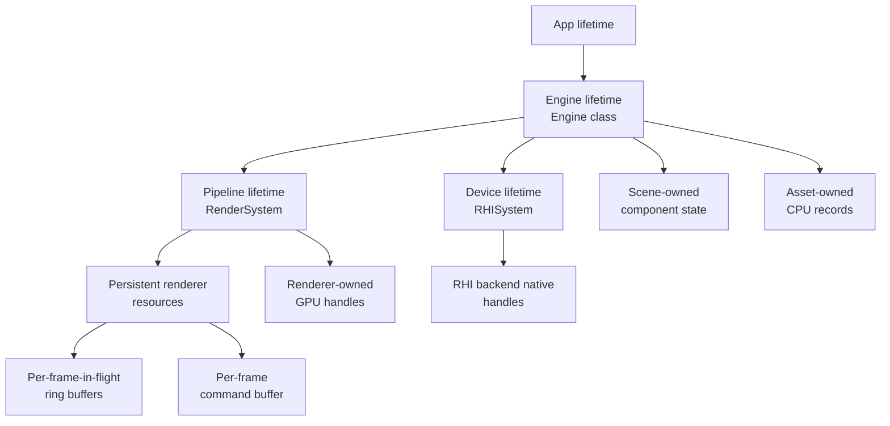
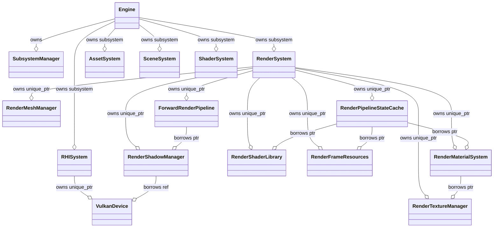

# 03 Ownership and Lifetime

## 1. Lifetime Categories

XEngine distinguishes eight lifetime categories. Each is bound to a specific
owner; the rest of the code only borrows via raw pointers or handles.

| Category | Owner | Span |
|---|---|---|
| Engine-lifetime | SubsystemManager processes them | `Engine::Initialize` -> `Engine::Shutdown` |
| Device-lifetime | `RHISystem` (`RHIDevice*` instance) | `RHISystem::OnCreate` -> `RHISystem::OnDestroy` |
| Persistent renderer resources | `RenderSystem` via 7 `unique_ptr` managers | `RenderSystem::OnCreate` -> `RenderSystem::OnDestroy` |
| Per-frame-in-flight ring | `RenderFrameResources` (`RendererMaxFramesInFlight = 3`) | `RenderFrameResources::Initialize` -> `RenderFrameResources::Shutdown` |
| Per-frame | Active `RHICommandList`/command buffer | `RHIDevice::BeginFrame` -> `RHIDevice::EndFrame` |
| Scene-owned | `Scene` instance owned by `SceneSystem` | `SceneSystem::OnCreate` -> first destroy / new scene |
| Asset-owned | `AssetSystem` registry | `AssetSystem::OnCreate` -> `AssetSystem::OnDestroy` |
| RHI backend native | `VulkanDevice` and its private members (instance, surface, allocator, swapchain, frame resources) | `VulkanDevice::Initialize` -> `VulkanDevice::Shutdown` |

## 2. Subsystem and Manager Startup Order

`Engine::Initialize` (`Engine/Source/Runtime/Engine/Private/Engine.cpp:48-71`)
constructs subsystems in this order:

1. `Log::Initialize()`, `ProjectPaths::Initialize()` (statics).
2. `PlatformSystem` (SDL3 main-window creation).
3. `InputSystem`.
4. `ShaderSystem` (slang compiler).
5. `AssetSystem` (asset metadata, importers).
6. `SceneSystem` (default scene + DebugCameraController).
7. `RHISystem` (creates `VulkanDevice` if `CreateGraphicsDevice`).
8. `RenderSystem`.
9. App-specific additions (Editor adds `EditorSystem`).

`RHISystem::OnCreate` (`RHI/Private/RHIDevice.cpp:28-79`) creates the device,
which itself creates the Vulkan instance, surface, queues, swapchain,
descriptor pool, depth target, and frame resources in that order
(`VulkanDevice::Initialize`, lines 132-225).

`RenderSystem::OnCreate` (`Renderer/Private/RenderSystem.cpp:297-397`)
constructs its 7 owned managers in this order:

1. `RenderTextureManager::Initialize(device)`.
2. `RenderMeshManager::Initialize(device)`.
3. `RenderMaterialSystem::Initialize(textures, device)`.
4. `RenderShaderLibrary::Initialize(device, shaderSystem)`.
5. `RenderFrameResources::Initialize(device, shadowSampledView, shadowSampler)`
   (constructed but not yet initialized at line 341; the actual `Initialize`
   happens after `ShadowManager::Initialize`).
6. `RenderShadowManager::Initialize(device)`.
7. `RenderFrameResources::Initialize(...)`.
8. `RenderPipelineStateCache::Initialize(device, shaders, materials,
   frameResources)`.
9. `ForwardRenderPipeline::Initialize(resources)`.

After all Initialize steps complete, `RenderSystem` populates its
`RenderResourceContext` with raw pointers to the 7 managers so that passes
can consume them uniformly.

`RenderSystem::Shutdown` (`Renderer/Private/RenderSystem.cpp:69-129`) destroys
in reverse order: pipeline, frame resources, pipeline states, shadow manager,
shaders, materials, meshes, textures; then clears the `RenderResourceContext`
and base pointers.

## 3. Per-Class Ownership Matrix

### `RHIDevice` (`VulkanDevice`)

- **Owns**: Vulkan instance, surface, physical device, logical device,
  graphics + present queues (wrapped by `VulkanQueue`), VMA allocator,
  descriptor pool, swapchain (image + image views + extent), depth target,
  frame resources (one in-flight fence, one image-available semaphore, N
  render-finished semaphores where N = swapchain image count, one command
  pool, one primary command buffer), command list, resource factory, upload
  manager.
- **Borrows**: nothing; construction reads `EngineConfig` to decide on the
  validation layer.
- **Lifetime risks**:
  - `vkAcquireNextImageKHR` can return `VK_ERROR_OUT_OF_DATE_KHR` /
    `VK_SUBOPTIMAL_KHR`; the device sets `m_ResizeRequested` and returns
    `nullptr` from `BeginFrame`, but caller (RenderSystem) does not currently
    retry after a resize; instead it relies on the next call into
    `BeginFrame`.
  - `RHIDevice::Shutdown` calls `WaitIdle` before destroying the swapchain
    and frame resources. This is the only synchronization barrier at
    shutdown.
- Source: `RHI/Private/Vulkan/VulkanDevice.{h,cpp}`.

### `RHIResourceFactory` (`VulkanResourceFactory`)

- **Owns**: nothing. Acts purely as an NVI dispatcher.
- **Borrows**: the parent `RHIDevice` (held by reference), the VMA allocator,
  and the descriptor pool.
- Source: `RHI/Private/RHIResourceFactory.cpp`, `RHI/Private/Vulkan/VulkanResourceFactory.cpp`.

### `RHIUploadManager`

- **Owns**: nothing persistent. Each `UploadBuffer` / `UploadTexture` call
  uses a dedicated staging buffer and a one-shot command buffer from
  `VulkanDevice::ImmediateSubmit` (`VulkanDevice.cpp:775-818`), then frees
  the staging buffer.
- Documents itself as **blocking** and **single-threaded** at
  `RHI/Public/XEngine/RHI/RHIUploadManager.h:11-13`. It is **not** safe to
  use from inside a recorded command buffer; the upload completes before the
  function returns.
- **Lifetime risk**: `UploadBuffer` always uses a CPU-visible staging buffer
  + memcpy + memory barrier, so the buffer's GPU backing memory is updated
  before the call returns. This is fine for editor / first-frame uploads but
  will become a bottleneck when rendering larger textures.
- Source: `RHI/Private/Vulkan/VulkanUploadManager.{h,cpp}`.

### `RenderFrameResources`

- **Owns**: `m_FrameBindGroupLayout` (one `BindGroupLayout`), 3 `GPUFrameData`
  uniform buffers, 3 bind groups bound to those buffers, optional
  placeholder shadow texture/view/sampler.
- **Borrows**: `shadowSampledView` + `shadowSampler` (raw pointer; can be
  replaced at runtime via `SetShadowBindings`).
- **Recreated when**: shadow sampled view or sampler pointer changes
  (`SetShadowBindings` calls `RebuildBindGroups`).
- **Lifetime risk**: `SetShadowBindings` keeps raw pointers to the shadow
  resources. Caller must guarantee they outlive the renderer.
- Source: `Renderer/Private/Resources/RenderFrameResources.{h,cpp}`.

### `RenderTextureManager`

- **Owns**: `RHITexture*` raw pointers retained inside its internal map,
  keyed by `TextureHandle` (`Renderer/Public/XEngine/Renderer/Texture.h`).
  Includes default White/Black/Normal/Missing textures created on first init.
- **Borrows**: the `RHIDevice`.
- **Recreated when**: never (texture cache; textures are reused).
- Source: `Renderer/Private/Resources/RenderTextureManager.{h,cpp}`.

### `RenderMeshManager`

- **Owns**: vertex buffers + index buffers + submesh metadata. Pool-resident
  via `RHIBuffer`/`RHITexture`-shaped RAII wrappers.
- **Borrows**: the `RHIDevice` and the `AssetSystem` (only via
  `GetOrCreateMeshFromAsset`).
- Source: `Renderer/Private/Resources/RenderMeshManager.{h,cpp}`.

### `RenderMaterialSystem`

- **Owns**: `MaterialRecord`s with `MaterialDesc` + `GPUMaterialData` UBO
  contents and the bind groups per material. Two bind-group layouts:
  `BaseColor` and `PBR`.
- **Borrows**: `RenderTextureManager` for resolving texture handles.
- Source: `Renderer/Private/Resources/RenderMaterialSystem.{h,cpp}`.

### `RenderShadowManager`

- **Owns**: `ShadowResourceCache` + `DirectionalShadowPlanner` (values) and
  last frame's `RenderShadowFrameData`. Optionally keeps a
  `m_FrozenFrameData` for the debug "freeze shadow matrices" mode.
- **Borrows**: the `RHIDevice` and the active scene/render scene.
- **Recreated when**: shadow shape (resolution, cascade count, format,
  storage mode) changes. The cache is lazy and recreates the array texture,
  sampled view, per-layer depth view, and sampler only on shape mismatch.
- Source: `Renderer/Private/Shadows/RenderShadowManager.{h,cpp}`,
  `ShadowResourceCache.{h,cpp}`, `DirectionalShadowPlanner.{h,cpp}`.

### `ShadowResourceCache`

- **Owns**: `DirectionalShadowResources` struct (texture array, sampled view,
  per-layer depth views, sampler) plus cascade count / resolution / format.
- **Recreated when**: `DirectionalShadowResourceDesc` shape parameters
  differ from the cached value.
- Source: `Renderer/Private/Shadows/ShadowResourceCache.{h,cpp}`.

### GPUFrameData ring buffer

`Renderer/Private/Resources/RenderFrameResources.cpp:185-233` holds:

- `RendererMaxFramesInFlight = 3` `RHIBuffer`s, each `sizeof(GPUFrameData)`
  bytes (`RHIBufferUsage::Uniform`, `RHIMemoryUsage::CPUToGPU`).
- 3 bind groups built against `m_FrameBindGroupLayout`.

Index by `frame.FrameIndex % RendererMaxFramesInFlight`
(`GetResourceIndex`, `RenderFrameResources.cpp:350-353`).

> The RHI backend only provides one frame in flight. The renderer currently
> overwrites the same three indices whenever it cycles. See `07_Frames_In_Flight_And_GPU_Synchronization.md`.

### Shadow texture array

`ShadowResourceCache` keeps exactly one texture array across the whole engine
lifetime (until shape changes). Layers are exposed to the ShadowDepthPass via
`dir.CascadeDepthViews[cascadeIndex]` and to the ForwardOpaquePass via
`dir.SampledView` + `dir.Sampler`. There is no per-frame shadow array
duplication; the same resources are reused.

### Frame bind groups

`RenderFrameResources::m_FrameBindGroups[3]`. Bound to `GPUFrameData`
UBO + shadow texture view + shadow sampler. The cache key here is the frame
ring index, so a draw in frame N binds the GPUFrameData buffer captured at
the start of frame N. Because the resources are constant except for the
shadow texture pointer, the only rebuild trigger is a shadow cache
regeneration.

## 4. Resource Recreation Triggers

| Resource | Recreate trigger | Code location |
|---|---|---|
| Vulkan swapchain | Window resize, `VK_ERROR_OUT_OF_DATE_KHR`, `VK_SUBOPTIMAL_KHR` | `VulkanDevice::RecreateSwapchain` / `VulkanDevice::RequestResize` |
| Vulkan frame resources | Only if `renderFinishedSemaphoreCount` differs from new swapchain image count | `VulkanDevice.cpp:854-861` |
| Vulkan depth target | Resize -> `DestroyDepthTexture` then `CreateDepthTexture` | `VulkanDevice.cpp:835-852` |
| Shadow array texture | Cache `DirectionalShadowResourceDesc` differs from cached value | `ShadowResourceCache.cpp:66-164` |
| Frame bind groups | `SetShadowBindings` called with a new (view, sampler) pair | `RenderFrameResources.cpp:95-112` |
| Pipeline cache | Per-`GraphicsPipelineStateKey`, first request creates, subsequent requests return the same shared_ptr | `RenderPipelineStateCache.cpp:52-69` |
| Shader cache | Per-`RenderShaderKey`, first request compiles via Slang, subsequent requests return the same `RHIShader` | `RenderShaderLibrary.cpp` |

## 5. GPU Still-Using-the-Resource Hazards

- `RHIDevice::Shutdown` calls `vkDeviceWaitIdle` first (`VulkanDevice.cpp:234`),
  so destroying GPU primitives is safe. This is the only synchronization
  point in shutdown.
- `VulkanDevice::EndFrame` waits on `imageAvailableSemaphore` and signals
  `renderFinishedSemaphore` + `inFlightFence`. The render-finished semaphore
  is per swapchain image; we wait on it again in the next `vkQueuePresentKHR`
  before reading back.
- A resize does not happen at random: `RecreateSwapchain` waits for `vkDeviceWaitIdle`,
  destroys the depth target, recreates the swapchain, recreates the depth
  target, and only then modifies state (lines 821-867).
- `RenderFrameResources::SetShadowBindings` is called from the CPU inside
  `RenderSystem::Render`. The current-frame shadow view/sampler is captured
  by the bind group set. If the cache were ever replaced mid-frame, the bind
  group might reference a stale texture; this is currently avoided because
  `SetShadowBindings` is called between `ShadowManager->PrepareFrame` and
  `FrameResources->Update`, and pass iteration consumes the bind group
  immediately afterward.

## 6. Borrowed vs. Owned Summary

## 7. Source References

- `Engine/Source/Runtime/Engine/Private/Engine.cpp:48-122`
- `Engine/Source/Runtime/Renderer/Private/RenderSystem.cpp:69-129, 297-397`
- `Engine/Source/Runtime/RHI/Private/Vulkan/VulkanDevice.{h,cpp}`
- `Engine/Source/Runtime/RHI/Private/Vulkan/VulkanFrameResources.{h,cpp}`
- `Engine/Source/Runtime/RHI/Private/Vulkan/VulkanUploadManager.{h,cpp}`
- `Engine/Source/Runtime/Renderer/Private/Resources/RenderFrameResources.{h,cpp}`
- `Engine/Source/Runtime/Renderer/Private/Resources/RenderTextureManager.{h,cpp}`
- `Engine/Source/Runtime/Renderer/Private/Resources/RenderMeshManager.{h,cpp}`
- `Engine/Source/Runtime/Renderer/Private/Resources/RenderMaterialSystem.{h,cpp}`
- `Engine/Source/Runtime/Renderer/Private/Resources/RenderShaderLibrary.{h,cpp}`
- `Engine/Source/Runtime/Renderer/Private/Shadows/RenderShadowManager.{h,cpp}`
- `Engine/Source/Runtime/Renderer/Private/Shadows/ShadowResourceCache.{h,cpp}`
