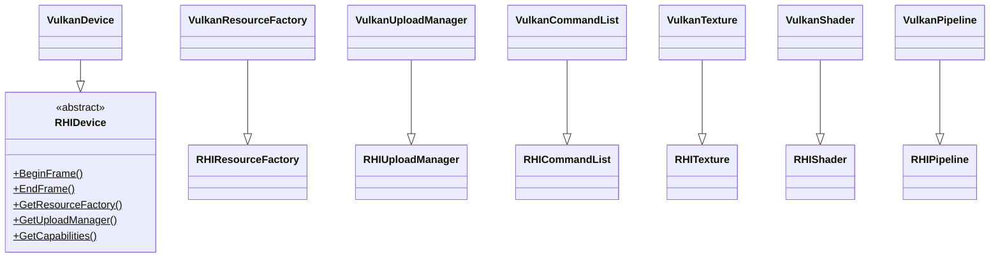
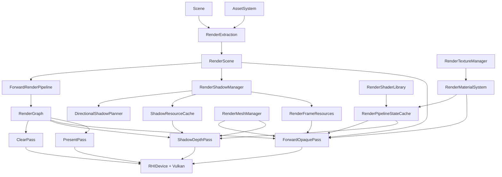
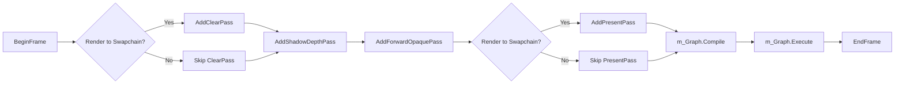

# 05 Rendering Architecture

## 1. Layered Responsibilities

```text
Application        : Sandbox / EditorApp
Engine subsystem   : RenderSystem        (ISubsystem owner + coordinator)
Pipeline           : RenderPipeline base / ForwardRenderPipeline concrete
Per-frame data     : RenderFrameContext  (carries camera, output, time)
Graph              : RenderGraph V0      (linear, ordered pass list)
Per-pass           : ClearPass, ShadowDepthPass, ForwardOpaquePass, PresentPass
Per-resource       : RenderTextureManager, RenderMeshManager, RenderMaterialSystem,
                     RenderShaderLibrary, RenderPipelineStateCache, RenderFrameResources,
                     RenderShadowManager
Scene -> Renderer  : RenderExtraction
RHI abstraction    : RHIDevice, RHICommandList, RHIResourceFactory, RHIUploadManager
Vulkan backend     : VulkanDevice, VulkanPipeline, VulkanShader, VulkanTexture, VulkanBuffer,
                     VulkanSampler, VulkanBindGroup, VulkanResourceFactory, VulkanUploadManager,
                     VulkanInstance, VulkanSurface, VulkanSwapchain, VulkanFrameResources,
                     VulkanCommandList, VulkanQueue, VulkanAllocator, VulkanCheckedCast
```

## 2. Class Diagram (Renderer -> RHI)

```mermaid
classDiagram
    class ISubsystem
    class RenderSystem {
        +OnCreate(ctx)
        +OnUpdate(dt)
    }

    class RenderPipeline {
        <<abstract>>
        +Initialize(ctx)$
        +Shutdown()$
        +Render(frame, scene, ctx)$
    }

    class ForwardRenderPipeline {
        -RenderGraph m_Graph
        +Render(frame, scene, ctx)
    }

    class RenderResourceContext {
        +Textures
        +Meshes
        +Materials
        +Shaders
        +PipelineStates
        +FrameResources
        +ShadowManager
    }

    class RenderFrameResources
    class RenderTextureManager
    class RenderMeshManager
    class RenderMaterialSystem
    class RenderShaderLibrary
    class RenderPipelineStateCache
    class RenderShadowManager
    class RenderExtraction
    class RenderScene
    class RenderGraph
    class RenderSystem --> RenderPipeline : owns unique_ptr
    RenderSystem --> RenderResourceContext : populates
    ForwardRenderPipeline --|> RenderPipeline
    ForwardRenderPipeline --> RenderGraph
    ForwardRenderPipeline --> RenderResourceContext
    RenderExtraction --> RenderResourceContext
    RenderExtraction --> RenderScene
    ForwardRenderPipeline --> RenderScene
```



## 3. Per-Frame Render Data Flow



## 4. Pass Order

The wired pass order in `ForwardRenderPipeline::Render`
(`Private/Pipeline/ForwardRenderPipeline.cpp:50-74`):



Notes:

- `AddShadowDepthPass` no-ops if `shadowManager->HasDirectionalShadow()` is
  false. In Sandbox runs the shadow manager eventually settles to "enabled"
  once the scene has been processed at least once.
- `AddPresentPass` is a logical placeholder; the actual present happens in
  `RHIDevice::EndFrame`.
- Off-screen render targets (`OutputProvider` provided) skip both the clear
  and present passes.

## 5. Pass Responsibilities

| Pass | File | Responsibility |
|---|---|---|
| `ClearPass` | `Passes/ClearPass.cpp` | Calls `RHIDevice::ClearSwapchain(color)`. Issues an image layout transition to `TRANSFER_DST_OPTIMAL` and `vkCmdClearColorImage`. |
| `ShadowDepthPass` | `Passes/ShadowDepthPass.cpp` | Iterates the directional shadow map's cascades; sets a depth-only render output per cascade; binds the shadow-depth graphics pipeline; iterates `CastShadow` opaque objects; pushes `ShadowDepthPushConstants` per object; submits `DrawIndexed` per submesh; transitions each cascade depth attachment from `DEPTH_ATTACHMENT_OPTIMAL` to `SHADER_READ_ONLY_OPTIMAL`. |
| `ForwardOpaquePass` | `Passes/ForwardOpaquePass.cpp` | Iterates `RenderScene::OpaqueObjects`; for each visible object fetches the GPU mesh + material bind groups; constructs a `GraphicsPipelineStateKey`; sets the pipeline; binds Set 0 (frame) and Set 1 (PBR material); records `DrawIndexed` per submesh with `PBRPushConstants`. |
| `PresentPass` | `Passes/PresentPass.cpp` | No-op. Reserved for future explicit present command. |

## 6. RHI Boundary

The Renderer only consumes the public RHI surface:

- `RHIDevice`, `RHICommandList`, `RHIResourceFactory`, `RHIUploadManager`,
  `RHITexture`, `RHITextureView`, `RHIBuffer`, `RHIShader`, `RHIPipeline`,
  `RHIBindGroup`, `RHIBindGroupLayout`, `RHISampler`, `RHIFormat`,
  `RHIRenderOutputDesc`, `RHIClipSpaceConvention`, `RHICapabilities`.

No `Vk*` types, volk headers, or VMA headers are referenced from
`Renderer/Private/`. The only escape hatch is the editor-only ImGui overlay,
which is invoked via `RHIDevice::RenderVulkanOverlay`
(`RHI/Private/Vulkan/VulkanDevice.cpp:578-647`) inside the editor's
`OverlayCallback`. Editor code consumes `RHINativeCommandBuffer`
(`uintptr_t`) instead of a Vulkan handle.

## 7. Vulkan Backend Boundary

Everything Vulkan-specific lives under `RHI/Private/Vulkan/`:

- Lifecycle: `VulkanDevice`, `VulkanInstance`, `VulkanSurface`, `VulkanSwapchain`, `VulkanFrameResources`.
- Memory + sync: `VulkanAllocator` (VMA), `VulkanQueue` (`VkQueue` wrapper), `VulkanCommandList`.
- Resources: `VulkanBuffer`, `VulkanTexture`, `VulkanTextureView`, `VulkanShader`, `VulkanPipeline`, `VulkanSampler`, `VulkanBindGroup`, `VulkanBindGroupLayout`, `VulkanCheckedCast`.
- Construction: `VulkanResourceFactory`, `VulkanUploadManager`.

Validation is enabled by `EngineConfig::EnableValidation` (default `true`) and
forwarded via `RHISystem` to `VulkanInstance::Create`. The validation layer is
probed with `VK_LAYER_KHRONOS_validation`; if absent the engine logs a warning
and continues.

## 8. Frame Constants and Discrepancies

There is one architectural inconsistency worth tracking. The Renderer declares
a `RendererMaxFramesInFlight = 3` ring (`RenderFrameResources.h:23`), while
the RHI backend hard-codes `MaxFramesInFlight = 1`
(`VulkanFrameResources.h:11`). `VulkanDevice::BeginFrame` waits on a single
in-flight fence every frame
(`VulkanDevice.cpp:316-317`). Practically this means the CPU is throttled to
"one submitted frame at a time" while the renderer pretends to advance a
triple ring through `RendererMaxFramesInFlight`. The `GetResourceIndex` ring
behaves correctly for the CPU side even with only one GPU fence because the
per-frame resources are CPU-only UBOs (the GPU does not race over them).

Implication for future work:

- If RenderGraph V1 introduces async compute or async upload, the
  `MaxFramesInFlight` constants must be reconciled.
- `VulkanFrameResources.Create` writes `MaxFramesInFlight` to a constant rather
  than using it as a multi-resource allocator; the constant is currently
  dead code and should be removed or implemented.

## 9. Source References

- `Engine/Source/Runtime/Renderer/Public/XEngine/Renderer/RenderSystem.h`
- `Engine/Source/Runtime/Renderer/Private/RenderSystem.cpp`
- `Engine/Source/Runtime/Renderer/Private/Pipeline/ForwardRenderPipeline.{h,cpp}`
- `Engine/Source/Runtime/Renderer/Private/RenderGraph/RenderGraph.{h,cpp}`
- `Engine/Source/Runtime/Renderer/Private/Passes/{Clear,ShadowDepth,ForwardOpaque,Present}Pass.cpp`
- `Engine/Source/Runtime/Renderer/Private/Resources/*.{h,cpp}`
- `Engine/Source/Runtime/Renderer/Private/Shadows/*.cpp`
- `Engine/Source/Runtime/Renderer/Private/Scene/RenderExtraction.{h,cpp}`
- `Engine/Source/Runtime/RHI/Public/XEngine/RHI/*.h`
- `Engine/Source/Runtime/RHI/Private/RHIResourceFactory.cpp`
- `Engine/Source/Runtime/RHI/Private/Vulkan/*.{h,cpp}`
