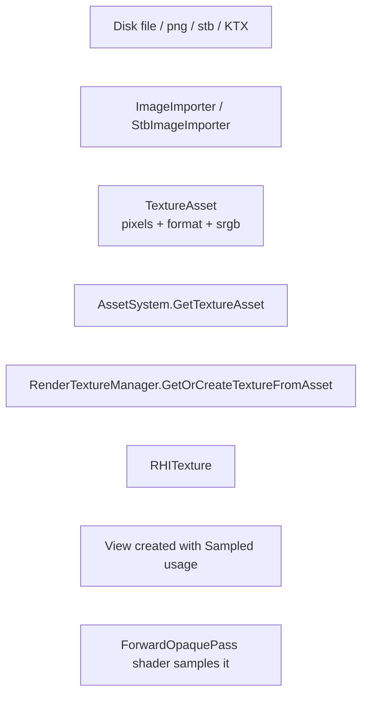
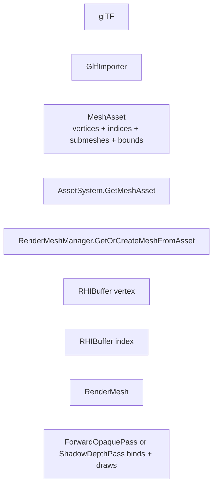
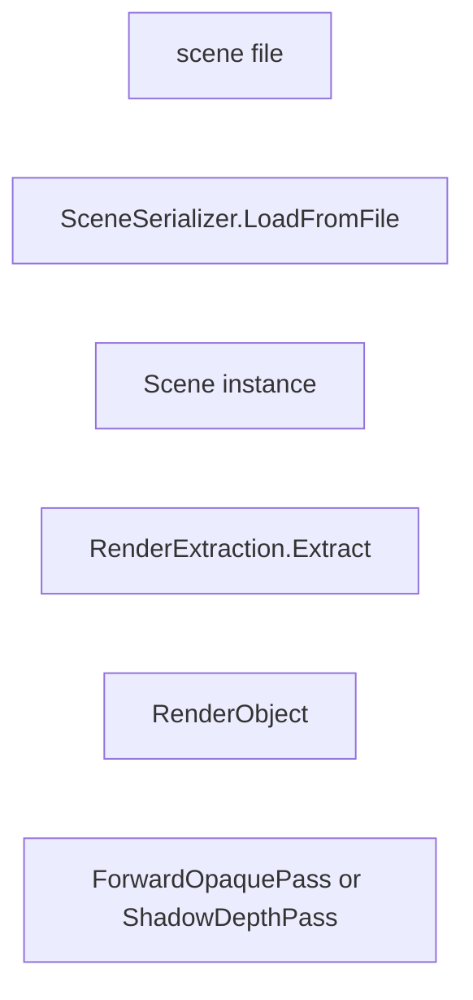
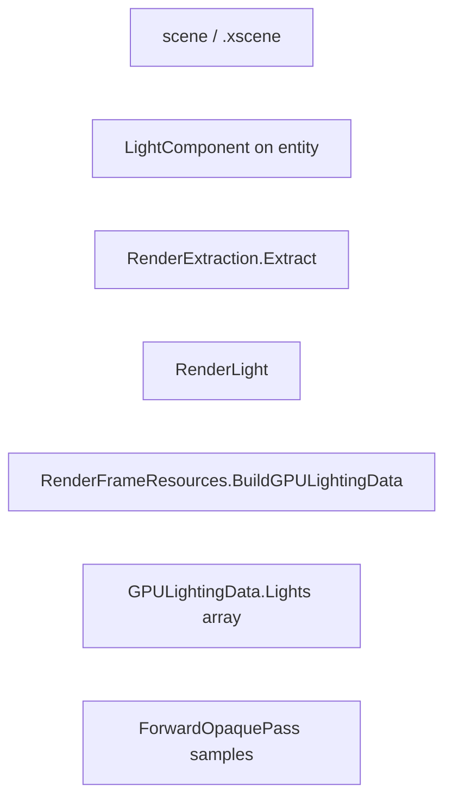

# 06 Asset To Render Data Flow

This document traces how data moves from an imported source asset (glTF file,
procedural cube, etc.) all the way to GPU-bound resources consumed by passes.

## 1. Asset System Overview

The `XEngineAsset` module owns the asset registry. It contains:

- `class AssetSystem` - the engine subsystem that registers import sources and
  resolves `AssetHandle`s to CPU records. It is itself the only module that
  talks to disk paths and the glTF importer.
- `AssetMetadata` (per-handle) - `Handle, Type, SourcePath, Name,
  LoadState, Dependencies`.
- Asset record types under `Asset/Public/XEngine/Asset/Assets/`:
  `TextureAsset`, `MeshAsset`, `MaterialAsset`, `SceneAsset`,
  `ShaderAsset`. (SceneAsset and ShaderAsset are placeholders.)
- Importers under `Asset/Private/Importers/`:
  `GltfImporter.cpp`, `ImageImporter.cpp`, `MaterialImporter.cpp`,
  `StbImageImporter.cpp`, `TextureImporter.cpp`, `ImporterRegistry.cpp`.

The asset system exposes `GetMeshAsset(AssetHandle)` and
`GetMaterialAsset(AssetHandle)` as the only public read API used by the
renderer. All other asset operations are private.

## 2. Asset System -> Renderer

The renderer reaches assets through two narrow APIs:

1. During extraction: `RenderExtraction::Extract` calls
   `AssetSystem::GetMeshAsset(renderer->MeshAsset)` and
   `AssetSystem::GetMaterialAsset(renderer->MaterialAsset)` to fetch the
   CPU-side records for the current entity.
2. Resource creation: the renderer-side managers call
   `GetOrCreateMeshFromAsset`, `GetOrCreateMaterialFromAsset`, and
   `LoadTexture2D` / `CreateTextureFromAsset` to lazily create GPU resources
   and bind-group structures.

## 3. End-to-End Flow by Resource Type

### 3.1 Texture



- `Engine/Source/Runtime/Asset/Private/Importers/ImageImporter.cpp` and
  `StbImageImporter.cpp` decode pixels into `TextureAsset::Pixels`.
- `AssetSystem` stores the CPU record keyed by `AssetHandle`.
- `RenderTextureManager::GetOrCreateTextureFromAsset(handle, asset, srgb)`
  (`Renderer/Private/Resources/RenderTextureManager.cpp`) calls
  `AssetSystem.GetTextureAsset(handle)` indirectly, then asks the
  `RHIResourceFactory` for a texture + sampled view via
  `RHITextureDesc { Width, Height, Format, Usage = Sampled |
  ColorAttachment, ... }`.
- Image data is uploaded via `RHIDevice::GetUploadManager().UploadTexture(...)`
  using the device's staging buffer path.
- `RHITextureView(sampled)` is created with
  `RHITextureViewUsageFlags::Sampled`.
- The forward pass binds the texture + sampler through the material's
  base-color / normal / metallic-roughness / AO bind groups.

### 3.2 Mesh



- `Engine/Source/Runtime/Asset/Private/Importers/GltfImporter.cpp` produces
  `MeshAsset` with `MeshVertex { Position, Normal, Tangent, TexCoord0 }`
  loaded into `std::vector` storage.
- `RenderMeshManager::GetOrCreateMeshFromAsset(handle, asset)`
  uploads through `RHIUploadManager` and creates one
  `RHIBuffer(Vertex)` and one `RHIBuffer(Index)` for the asset.
- The manager exposes `RenderMesh { Submeshes, VertexBuffer, IndexBuffer,
  IndexFormat }`.
- `ForwardOpaquePass` and `ShadowDepthPass` read the mesh and call
  `SetVertexBuffer / SetIndexBuffer / DrawIndexed` per submesh.

### 3.3 Material

```mermaid
flowchart LR
    File[glTF material definition]
    GltfImp[GltfImporter]
    MatA[MaterialAsset<br/>ShadingModel + AlphaMode + factor + texture handles]
    AssetSys[AssetSystem.GetMaterialAsset]
    RMS[RenderMaterialSystem.GetOrCreateMaterialFromAsset]
    Rec[MaterialRecord + GPUMaterialData]
    UB[UBO write buffer (CPU-to-GPU uniform)]
    BG0[BaseColor bind group<br/>set 1, binding 0]
    BG1[PBR bind group<br/>set 1, binding 1..3]
    Pass[ForwardOpaquePass binds]
```

- `RenderMaterialSystem::CreateMaterialFromAsset`
  (`Renderer/Private/Resources/RenderMaterialSystem.cpp`) creates:
  - Two bind-group layouts (BaseColor, PBR) the first time.
  - For each material: a `MaterialRecord` with CPU desc, GPU material data,
    and per-material bind groups.
  - The PBR bind-group layout owns:
    - binding 0: `MaterialDataUBO` (uniform buffer with `BaseColorFactor`,
      `MetallicFactor`, `RoughnessFactor`, `AlphaCutoff`).
    - binding 1: `baseColorTexture` (`SampledTexture`).
    - binding 2: `normalTexture` (`SampledTexture`).
    - binding 3: `metallicRoughnessTexture` (`SampledTexture`).
    - binding 4: `aoTexture` (`SampledTexture`).
  - The BaseColor layout owns:
    - binding 0: `MaterialDataUBO`.
    - binding 1: `baseColorTexture`.

> The shader currently binds `baseColorTexture`, `normalTexture`,
> `metallicRoughnessTexture`, and `aoTexture` against Set 1 (`ForwardPBR.slang`).
> The C++ layout must add bindings 2 and 4 if the current shader bindings are
> to be honored; current `RenderMaterialSystem.cpp` layout is documented at
> the bind group level and may need to be extended to match the shader.

### 3.4 Scene Entity



- `Engine/Source/Runtime/Scene/Private/Serialization/SceneSerializer.cpp`
  reads the `.xscene` JSON and rehydrates entity + component state into the
  `Scene` instance held by `SceneSystem`.
- `RenderExtraction::Extract` (called once per frame from
  `RenderSystem::Render`) iterates `Scene::GetEntities()`, fetches the
  `MeshRendererComponent` and the `TransformComponent`, asks the renderer
  managers to materialize meshes + materials as needed, then emits a
  `RenderObject` for the opaque queue.
- `RenderObject` is built with: `WorldMatrix`, `PreviousWorldMatrix`, `Mesh`,
  `Material`, `WorldBounds`, `ObjectId`, `Visible`, `CastShadow`,
  `ReceiveShadow`. The pass iterates them in order.

### 3.5 Light



- `LightComponent { Type (Directional/Point/Spot), Color, Intensity, Range,
  Inner/OuterConeAngleDegree, CastShadow, Enabled }`.
- `RenderExtraction::Extract` walks `Scene::GetLight(entity)`; for enabled
  lights it builds a `RenderLight { Type, Position, Range, Color, Intensity,
  Inner/OuterConeAngleRadians, CastShadow, DirectionToLight }`.
- `DirectionToLight = Math::Normalize(-forward)` per
  `Extract`'s comment: "Light forward is rotated +X and represents the direction
  light rays travel. Shading uses direction from surface point to light, so
  DirectionToLight is -forward."
- `RenderFrameResources::BuildGPULightingData` packs up to `MaxGPULights`
  enabled lights into `GPULightingData` (defaults: directional position range
  zeroed; point/spot use position; spot angles in `SpotAnglesShadow.z` etc.).

## 4. Lifetime Path Summary

| Asset subsystem owner | Lifetime |
|---|---|
| AssetSystem registry | Engine |
| TextureAsset / MeshAsset / MaterialAsset | AssetSystem (CPU only) |
| RHITexture (texture manager entry) | RenderTextureManager (engine-lifetime key) |
| RHIBuffer vertex/index | RenderMeshManager (engine-lifetime key) |
| MaterialRecord + bind groups | RenderMaterialSystem (engine-lifetime key) |
| RenderObject | RenderScene, re-built each frame from `Scene` |

## 5. Boundary Verification

The current code respects these boundaries:

- Asset public headers (`Engine/Source/Runtime/Asset/Public/XEngine/Asset/*`)
  do not include RHI / Renderer / Vulkan / Slang / fastgltf / stb headers.
- `RenderExtraction.cpp` is the only file in `Renderer/` that calls into
  `AssetSystem::Get*Asset`.
- Renderer managers consume `AssetHandle` values from scene components;
  they do not see raw record pointers.

## 6. Open Items and Friction Points

- The shader binding model does not currently match the bind-group layout
  exactly. `ForwardPBR.slang` declares bindings at `(0,0)`, `(0,1)`,
  `(1,1)`, `(2,1)`, `(3,1)` for frame data + base color + normal +
  metallic-roughness. The renderer material bind groups must therefore add
  layout entries for slots 0/1/2/3 at Set 1, with their respective types.
- `RenderMaterialSystem::Initialize` is the place where these layouts should
  be created. It is currently a partial implementation (see source for the
  actual entry list).
- `SceneAsset` and `ShaderAsset` are placeholders; the full asset round-trip
  for scenes / shaders remains a future-stage concern.

## 7. Source References

- `Engine/Source/Runtime/Asset/Public/XEngine/Asset/AssetSystem.h`
- `Engine/Source/Runtime/Asset/Public/XEngine/Asset/Assets/{Texture,Mesh,Material}Asset.h`
- `Engine/Source/Runtime/Asset/Private/AssetSystem.cpp`
- `Engine/Source/Runtime/Asset/Private/AssetDatabase.cpp`
- `Engine/Source/Runtime/Asset/Private/AssetRegistry.cpp`
- `Engine/Source/Runtime/Asset/Private/Importers/{Gltf,Image,Material,StbImage,Texture}Importer.cpp`
- `Engine/Source/Runtime/Renderer/Private/Scene/RenderExtraction.cpp`
- `Engine/Source/Runtime/Renderer/Private/Resources/RenderTextureManager.{h,cpp}`
- `Engine/Source/Runtime/Renderer/Private/Resources/RenderMeshManager.{h,cpp}`
- `Engine/Source/Runtime/Renderer/Private/Resources/RenderMaterialSystem.{h,cpp}`
- `Engine/Source/Runtime/Renderer/Private/Resources/RenderFrameResources.cpp:235-279`
