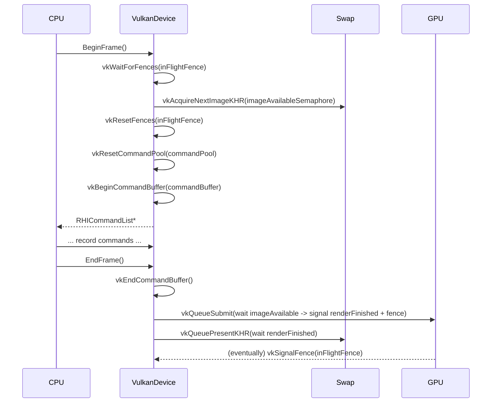
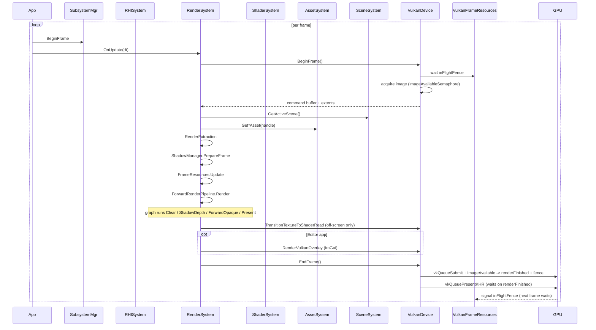

# 07 Frames In Flight And GPU Synchronization

## 1. Frame Pipeline Summary

`RHIDevice` (currently `VulkanDevice`) is the synchronization boundary. One
active frame at a time is recorded by the host, and one active frame is in
flight on the GPU. The implementation uses the canonical
acquire-image/wait-fence/submit/present pattern but with a single fence instead
of a ring.



## 2. Allocated Sync Resources

`Engine/Source/Runtime/RHI/Private/Vulkan/VulkanFrameResources.{h,cpp}`
defines the lifecycle owner:

```cpp
static constexpr u32 MaxFramesInFlight = 1;  // header line 11

VkCommandPool     m_CommandPool;
VkCommandBuffer   m_CommandBuffer;
VkSemaphore       m_ImageAvailableSemaphore;
std::vector<VkSemaphore> m_RenderFinishedSemaphores; // size == swapchain image count
VkFence           m_InFlightFence;
```

`VulkanFrameResources::Create(device, graphicsQueueFamily, swapchainImageCount)`
(lines 14-86) creates exactly:

- One command pool with `VK_COMMAND_POOL_CREATE_RESET_COMMAND_BUFFER_BIT`.
- One primary command buffer.
- One image-available semaphore.
- One render-finished semaphore per swapchain image.
- One in-flight fence with `VK_FENCE_CREATE_SIGNALED_BIT`.

There is no per-frame ring of fences or per-frame ring of command buffers
despite the comment `MaxFramesInFlight = 1`.

On swapchain recreation the `VulkanFrameResources` are rebuilt only if the
new image count differs from the existing render-finished-sempahore count
(`VulkanDevice.cpp:854-861`).

## 3. Per-Frame State Owned by Renderer

`Engine/Source/Runtime/Renderer/Private/Resources/RenderFrameResources.h:23`
declares:

```cpp
static constexpr u32 RendererMaxFramesInFlight = 3;
```

The three-frame ring buffers are used to advance frame indexing for
per-frame data:

```cpp
std::array<std::shared_ptr<RHIBuffer>, RendererMaxFramesInFlight> m_FrameBuffers;
std::array<std::shared_ptr<RHIBindGroup>, RendererMaxFramesInFlight> m_FrameBindGroups;
```

`GetResourceIndex(frameIndex) = frameIndex % RendererMaxFramesInFlight` selects
the slot.

This ring is **CPU-side only**: the GPU only sees the bind group that the
forward pass submits. There is no current need for an actual triple-buffered
UBO because no frame N+1 read can race with frame N before the CPU finishes
recording frame N+1 (the in-flight fence blocks BeginFrame).

## 4. Why Each Resource Lives Where It Does

### GPUFrameData buffer (Set 0 binding 0)

The buffer is updated each frame through `buffer->Update(&data, sizeof(data))`.
Per-frame indexing exists to support the case where the CPU recycles a
buffer before the GPU is finished with the previous contents. Today this is
belt-and-suspenders, because the single in-flight fence + single command
buffer guarantee the GPU cannot read the buffer of frame N+1 before frame N's
command buffer is fully retired. It is the right architectural shape for
when `MaxFramesInFlight > 1` is honored.

### Descriptor sets (frame bind groups)

Bindings are created from the current-frame buffer and the current shadow
sampled view + sampler. `SetShadowBindings` rebuilds the bind groups when the
shadow cache is recreated (V0 stage). For the typical case it is sufficient
to keep a single descriptor set per "ring" slot.

### Shadow texture array (Set 0 binding 1/2)

The cascade array is **device-lifetime** rather than per-frame. It is rebuilt
only when shape parameters change (resolution, cascade count, format,
storage mode). The same image is used across many frames, which is the
correct shape: the shadow resource doesn't change between frames.

## 5. Discrepancies

### `MaxFramesInFlight = 1` (RHI) vs `RendererMaxFramesInFlight = 3` (Renderer)

The renderer pretends to have three frames in flight for indexing purposes,
but the Vulkan backend blocks on a single fence. This causes:

- The renderer's ring cyclically aliases to indices 0/1/2 in source but the GPU
  never sees more than one in flight; the binding is correct for the
  CPU-after-fence model.
- If a future stage increases `VulkanFrameResources::MaxFramesInFlight` to
  actually match `RendererMaxFramesInFlight`, the renderer ring will start to
  matter and the GPU-side frame-resource schema must change.

### `RenderFrameResources::SetShadowBindings` debug field

The current `RenderFrameResources.cpp:109-110` carries an unused
`reinterpret_cast<std::uintptr_t>` debug print. It is dead code and should
be cleaned up.

## 6. Resource Reuse Strategy

| Resource | Per-frame? | Per-frame-in-flight? | Persistent? | Recreate trigger |
|---|---|---|---|---|
| `VkCommandBuffer` (single) | yes (one at a time) | - | - | recreated only if `VulkanFrameResources` itself recreates |
| `VkImageAvailableSemaphore` | - | yes (single instance) | engine-lifetime | only on swapchain rebuild that recreates `VulkanFrameResources` |
| `VkRenderFinishedSemaphore` array | - | yes (one per swapchain image) | engine-lifetime | resize with image count change |
| `VkInFlightFence` | - | yes (single instance) | engine-lifetime | only on VulkanFrameResources rebuild |
| `ShadowResourceCache` arrays | - | - | engine-lifetime | cache shape change |
| `GPUFrameData` UBO | yes (updated) | yes (ring of 3) | - | never recreated |
| `RHIBindGroup` for Set 0 | yes (rebound) | yes (3) | - | `SetShadowBindings` or ring rotation |
| `RHIShader` (compiled) | - | - | engine-lifetime | first `GetOrCreateShader` per `RenderShaderKey` |
| `RHIPipeline` (cached) | - | - | engine-lifetime | first `GetOrCreateGraphicsPipeline` per `GraphicsPipelineStateKey` |
| `RHITexture` (default white/black/normal) | - | - | engine-lifetime | created once in `RenderTextureManager::Initialize` |
| `RHITextureView` for the swapchain image | yes (per acquire) | - | - | only on swapchain rebuild |

## 7. Lifecycle Risks

- `RenderFrameResources::SetShadowBindings` keeps raw pointers to the shadow
  view / sampler; the cache is responsible for keeping them valid as long as
  the renderer needs them.
- `RHIDevice::EndFrame` uses `imageAvailableSemaphore` and
  `renderFinishedSemaphore[m_CurrentImageIndex]`. If the swapchain were
  reduced or expanded mid-frame, the indices into the render-finished array
  could read past the end. `RecreateSwapchain` rebuilds the array before the
  next `BeginFrame`, so this is safe.
- `RHIDevice::Shutdown` calls `vkDeviceWaitIdle` first (`VulkanDevice.cpp:234`)
  before destroying any GPU primitives.

## 8. Sequence of One Frame (compact)



## 9. Source References

- `Engine/Source/Runtime/RHI/Private/Vulkan/VulkanDevice.cpp:285-514`
- `Engine/Source/Runtime/RHI/Private/Vulkan/VulkanFrameResources.{h,cpp}`
- `Engine/Source/Runtime/RHI/Private/Vulkan/VulkanDevice.cpp:727-757`
- `Engine/Source/Runtime/Renderer/Private/Resources/RenderFrameResources.h`
- `Engine/Source/Runtime/Renderer/Private/Resources/RenderFrameResources.cpp:185-233`
- `Engine/Source/Runtime/Renderer/Private/Shadows/ShadowResourceCache.cpp:66-164`
- `Engine/Source/Runtime/RHI/Private/Vulkan/VulkanUploadManager.{h,cpp}`
- `Engine/Source/Runtime/RHI/Public/XEngine/RHI/RHIUploadManager.h:11-13`
