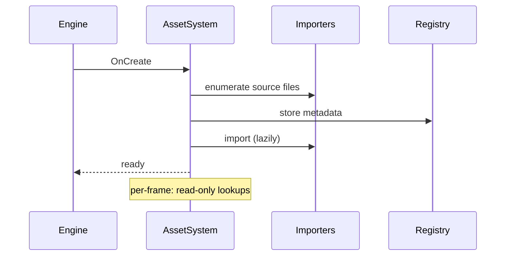

# AssetSystem

## 1. Role

Engine subsystem that owns the asset registry: keying `AssetHandle`s to
asset metadata, importing source files into CPU records through the
importer classes, and exposing read APIs (`GetMeshAsset`,
`GetMaterialAsset`, `GetTextureAsset`).

## 2. Source Location

- Header: `Engine/Source/Runtime/Asset/Public/XEngine/Asset/AssetSystem.h`
- Implementation: `Engine/Source/Runtime/Asset/Private/AssetSystem.cpp`
- Database / registry: `AssetDatabase.cpp`, `AssetRegistry.cpp`,
  `AssetManager.cpp`
- Importers: `Engine/Source/Runtime/Asset/Private/Importers/*.cpp`

## 3. Owned State

- The asset registry (handles -> records, source-of-truth paths,
  dependencies).
- `m_AssetMetadata` (per-handle metadata map).
- Optional procedural helpers
  (`CreateProceduralCubeMeshAsset`, `CreateTestMaterialAsset`).

## 4. Borrowed Dependencies

- Importer classes (`GltfImporter`, `ImageImporter`,
  `MaterialImporter`, `TextureImporter`, `StbImageImporter`).
- `fastgltf` (PRIVATE).

## 5. Lifetime

- Constructed by `Engine::Initialize` as a subsystem after
  `ShaderSystem`.
- `OnCreate` registers all import sources; `OnDestroy` clears the
  registry.

## 6. Callers and Used By

- `RenderExtraction::Extract` reads asset records every frame.
- The renderer managers call into it for GPU resource creation.
- `Apps/Sandbox/Source/main.cpp` indirectly drives the registry
  through its scene loading.

## 7. Main Collaborators

- `TextureAsset`, `MeshAsset`, `MaterialAsset` (and the placeholder
  types).
- Importers under `Private/Importers/`.

## 8. Runtime Sequence

## 9. Important Invariants

- Handles are stable for the engine lifetime.
- Records are CPU-only.
- Public Asset headers do not include any RHI / Vulkan / fastgltf /
  stb / Slang type.

## 10. Invalid States and Failure Modes

- Failed imports log + skip; the handle still resolves to a null
  record.
- Missing source paths are logged and skipped at startup.

## 11. Threading and Synchronization Assumptions

- Main-thread only.

## 12. Design Rationale

- A single class consolidates registry, imports, and lookup;
  helpers in the cpp split registration for future stages.

## 13. Alternatives and Trade-offs

- Lazy / async import. Deferred.

## 14. Extension Points

- New asset types: add a record struct, a record lookup method, a
  metadata key, and an importer class.

## 15. Current Limitations

- No async import.
- `SceneAsset` and `ShaderAsset` are placeholders.

## 16. Source References

- `Engine/Source/Runtime/Asset/Public/XEngine/Asset/AssetSystem.h`
- `Engine/Source/Runtime/Asset/Private/AssetSystem.cpp`
- `Engine/Source/Runtime/Asset/Private/AssetDatabase.cpp`
- `Engine/Source/Runtime/Asset/Private/AssetRegistry.cpp`
- `Engine/Source/Runtime/Asset/Private/Importers/*.cpp`
