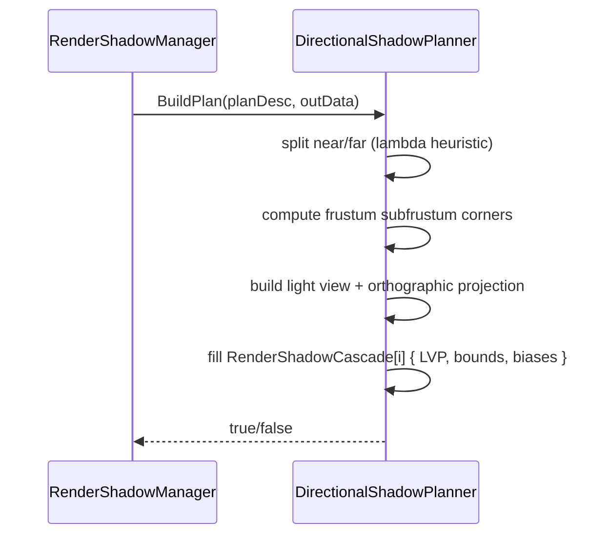

# DirectionalShadowPlanner

## 1. Role

Pure-math CSM planner for directional shadow maps. Computes split near /
far, builds per-cascade `LightView / LightProjection /
LightViewProjection` matrices, and exposes bias parameters for the
shader.

## 2. Source Location

- `Engine/Source/Runtime/Renderer/Private/Shadows/DirectionalShadowPlanner.{h,cpp}`

## 3. Owned State

Stateless. The class is held by value inside `RenderShadowManager`.

## 4. Borrowed Dependencies

- `RenderLight*` and other inputs from the per-frame
  `DirectionalShadowPlanDesc`.
- `Math` helpers used to build the orthographic projection that fits
  the cascade frustum.

## 5. Lifetime

- Constructed once inside `RenderShadowManager`.
- `BuildPlan` is invoked every non-frozen frame inside
  `RenderShadowManager::PrepareDirectionalShadow`.

## 6. Callers and Used By

- `RenderShadowManager::PrepareDirectionalShadow` (only caller).

## 7. Main Collaborators

- `RenderLight`, `RenderShadowCascade`, `RenderDirectionalShadowFrameData`.
- `Math` (basis conversion, orthographic projection).

## 8. Runtime Sequence

## 9. Important Invariants

- Cascade near/far are stored as `SplitNear` / `SplitFar` in the per-
  cascade struct (the shader receives these inside the `Params`
  vec4 of `GPUCascadeShadowData`).
- The planner reports failure (returns false) for unbuildable cases
  (e.g. zero-area cascade); the manager falls back to
  `Directional.Enabled = false`.

## 10. Invalid States and Failure Modes

- `DirectionalShadowPlanDesc::CascadeCount = 0` -> returns false.
- `Light == nullptr` or `CameraProjection` degenerate -> returns false.

## 11. Threading and Synchronization Assumptions

- Called from the main thread.

## 12. Design Rationale

- Statelessness keeps the planner cheap to test.
- Splitting math from the cache + manager lets future stages swap the
  planner for an alternative approach (e.g. fitted subfrustum, fit
  per receiver) without touching GPU resource code.

## 13. Alternatives and Trade-offs

- GPU-driven fit. Deferred; CPU is sufficient for V0.
- Uniform cascade splits. Rejected; lambda split gives better
  near-camera quality.

## 14. Extension Points

- New heuristics (PPSM, log-weighted) can be added without touching
  the manager.

## 15. Current Limitations

- Log/lambda split is the only mode.
- No receiver-fit math.

## 16. Source References

- `Engine/Source/Runtime/Renderer/Private/Shadows/DirectionalShadowPlanner.{h,cpp}`
- `Engine/Source/Runtime/Renderer/Private/Shadows/DirectionalShadowPlanner.h` (struct description)
- `Engine/Shaders/Lighting/ShadowTypes.slang`
