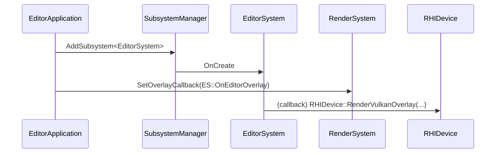

# EditorSystem

## 1. Role

Editor-only subsystem registered by `EditorApplication` through
`EngineConfig::ConfigureSubsystems`. Owns the editor's runtime state
(active scene, panel flags, layout state) and drives ImGui rendering
through the renderer's `OverlayCallback`.

## 2. Source Location

- `Engine/Source/Editor/Public/XEngine/Editor/EditorSystem.h`

## 3. Owned State

- The active editor scene reference.
- Layout state loaded from user-saved docking ini or default docking ini.
- ImGui-driven panel state for each registered panel
  (SceneHierarchy, Inspector, Viewport, etc.).

## 4. Borrowed Dependencies

- `RHIDevice*` (used inside the overlay callback for Vulkan drawing).
- Renderer `OverlayCallback` slot.

## 5. Lifetime

Constructed and registered by `EditorApplication::Run`. Lives for the
duration of the editor process.

## 6. Callers and Used By

- `EditorApplication` registers the subsystem.
- `RenderSystem::Render` invokes the registered `OverlayCallback`
  during the editor frame loop.

## 7. Main Collaborators

- ImGui panel implementations under `Engine/Source/Editor/Private/`.
- `EditorContext`, `EditorCamera`.

## 8. Runtime Sequence

## 9. Important Invariants

- Only registered when `XENGINE_ENABLE_EDITOR` is on.
- The overlay callback runs inside the render frame loop; it must not
  perform blocking work.

## 10. Invalid States and Failure Modes

- Misconfigured layout file: editor falls back to default docking.

## 11. Threading and Synchronization Assumptions

- Main-thread only.

## 12. Design Rationale

- Treats editor state as a regular subsystem so it can subscribe to
  the engine lifecycle.

## 13. Alternatives and Trade-offs

- A separate editor process. Rejected for V0.

## 14. Extension Points

- New panels register through `EditorSystem` (panel discovery is a
  future concern).

## 15. Current Limitations

- Vulkan-only overlay path.
- No hot reload.

## 16. Source References

- `Engine/Source/Editor/Public/XEngine/Editor/EditorSystem.h`
- `Engine/Source/Editor/Private/` (panel implementations)
- `Engine/Source/Runtime/RHI/Private/Vulkan/VulkanDevice.cpp:578-647`
