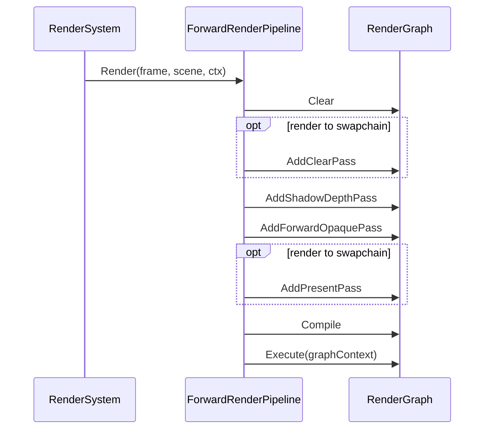

# ForwardRenderPipeline

## 1. Role

The concrete `RenderPipeline` subclass. Constructs the per-frame
`RenderGraph`, wires the passes, and dispatches them in order. It owns
the graph itself; passes are `Add*Pass` free functions that mutate the
graph.

## 2. Source Location

- `Engine/Source/Runtime/Renderer/Private/Pipeline/ForwardRenderPipeline.{h,cpp}`

## 3. Owned State

```cpp
RenderGraph m_Graph;
bool        m_Initialized = false;
```

## 4. Borrowed Dependencies

- All seven managers through `RenderResourceContext` (provided by
  `RenderSystem::Render`).

## 5. Lifetime

`Initialize` validates `resources.IsValid()` and sets
`m_Initialized = true`. `Shutdown` clears the graph.

## 6. Callers and Used By

- `RenderSystem::Render` calls `ActivePipeline->Render(frame, sceneData,
  resources)`.

## 7. Main Collaborators

- `RenderGraph` (V0/linear).
- `ClearPass`, `ShadowDepthPass`, `ForwardOpaquePass`, `PresentPass`.

## 8. Runtime Sequence



## 9. Important Invariants

- The pipeline must be initialized before `Render` is called.
- `frame.Device` and `frame.CommandList` are required; both are
  checked in `Render` and the function returns if either is null.

## 10. Invalid States and Failure Modes

- Uninitialized pipeline -> early return without drawing.
- Missing device or command list -> same early return.

## 11. Threading and Synchronization Assumptions

- Single-threaded; driven by `RenderSystem::Render` once per frame.

## 12. Design Rationale

- A single concrete pipeline keeps the V0 architecture simple.
- Passes are free functions that mutate the graph to keep the
  pipeline file small.

## 13. Alternatives and Trade-offs

- A graph-source DSL or compiler-driven generator. Deferred to
  RenderGraph V1.
- Multiple pipelines behind a strategy. Deferred to a RenderFeature
  abstract base.

## 14. Extension Points

- New passes are added through `Add*Pass(graph, ...)` functions.
- The pipeline is selectable through `RenderSystem::ActivePipeline`,
  allowing future `DeferredRenderPipeline` etc.

## 15. Current Limitations

- Only one order of passes; control flow is hardcoded.
- Lighting/shadow integration (`/TODO Stage 8B/8C/8D/`) not yet
  present.

## 16. Source References

- `Engine/Source/Runtime/Renderer/Private/Pipeline/ForwardRenderPipeline.{h,cpp}`
- `Engine/Source/Runtime/Renderer/Private/RenderGraph/RenderGraph.{h,cpp}`
- `Engine/Source/Runtime/Renderer/Private/Passes/*Pass.cpp`
