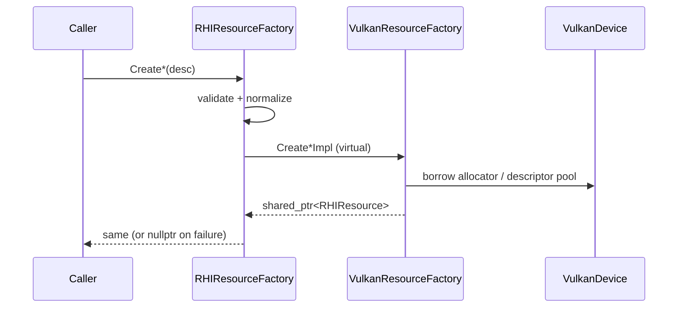

# RHIResourceFactory

## 1. Role

`RHIResourceFactory` is the NVI resource factory exposed through
`RHIDevice::GetResourceFactory()`. Its public methods validate and
normalize resource descriptors, then dispatch to backend-specific
`Create*Impl` virtual methods. The Vulkan backend implements those
methods to construct `VulkanBuffer`, `VulkanTexture`, etc.

## 2. Source Location

- Public header: `Engine/Source/Runtime/RHI/Public/XEngine/RHI/RHIResourceFactory.h`
- Generic implementation: `Engine/Source/Runtime/RHI/Private/RHIResourceFactory.cpp`
- Vulkan implementation: `Engine/Source/Runtime/RHI/Private/Vulkan/VulkanResourceFactory.cpp`

## 3. Owned State

Holds an owning `RHIDevice&` reference (`m_Device`). The Vulkan subclass
adds references to VMA, descriptor pool, and other per-device resources
needed to construct Vulkan handles.

## 4. Borrowed Dependencies

- The owning `RHIDevice` (passed in by the device constructor).
- All shader and layout inputs passed through the descriptor structs.

## 5. Lifetime

The factory is owned by the device: `VulkanDevice` constructs
`VulkanResourceFactory` after the allocator and descriptor pool are
available (see `VulkanDevice::Initialize`, lines 185-191). It is reset
inside `VulkanDevice::Shutdown` and is destroyed with the device.

## 6. Callers and Used By

- `RenderTextureManager`, `RenderMeshManager`, `RenderMaterialSystem`,
  `RenderPipelineStateCache`, `RenderFrameResources`,
  `RenderShadowManager` - all consume the public factory.
- `RHIDevice::GetResourceFactory()` is the public entry point.

## 7. Main Collaborators

- `VulkanResourceFactory` (concrete subclass).
- `VulkanDescriptor` (bind group / bind group layout creation).
- `VulkanPipeline` (graphics pipeline creation).
- `VulkanResource` family (`VulkanBuffer`, `VulkanTexture`,
  `VulkanTextureView`, `VulkanSampler`, `VulkanShader`).

## 8. Runtime Sequence

## 9. Important Invariants

- All `shared_ptr<RHIResource>` returned by the factory outlive any
  caller that holds a raw pointer to them. Backends must not transfer
  ownership or release externally.
- Bind-group resource validation enforces that:
  - all referenced resources belong to the same device;
  - bind group resource count matches layout entry count;
  - binding types are consistent.
- Push constant size validation (in `RHIResourceFactory::CreateGraphicsPipeline`)
  rejects pipeline creation when `desc.PushConstantSize > device.MaxPushConstantSize`.
- Descriptor `count` is currently required to equal `1`; arrays are not
  supported through this factory.

## 10. Invalid States and Failure Modes

- `CreateGraphicsPipeline` may fail if shaders do not belong to the
  owning device or the descriptor set count exceeds `MaxBoundDescriptorSets`.
- `CreateBindGroup` may fail if a referenced resource is null (e.g.
  combined image sampler without both `Texture` and `Sampler`); the
  failure is reported through the returned `nullptr`.

## 11. Threading and Synchronization Assumptions

- The factory is intended to be called from the main thread.
- Backend cast helpers (`VulkanCheckedCast`) are not multi-thread safe.

## 12. Design Rationale

- NVI: validate once in the base, dispatch to the backend once per call.
- Centralized bind-group validation guards against malformed descriptors
  reaching Vulkan.
- Returning `shared_ptr` simplifies ownership when handing resources to
  render managers.

## 13. Alternatives and Trade-offs

- An arena allocator (per pass) was deferred to a later stage; the
  global descriptor pool is sufficient for V0.
- A descriptor-type alias (e.g. CRTP) was rejected to avoid pulling in
  Vulkan headers indirectly.

## 14. Extension Points

- New resource types require:
  1. Adding a header under `RHI/Public/XEngine/RHI/Resources/`.
  2. Adding a `Create*` public method + `Create*Impl` virtual hook.
  3. Adding a backend class derived from the new resource.

## 15. Current Limitations

- Descriptor arrays (`count > 1`) are rejected by validation today.
- No suballocator for descriptor pools.

## 16. Source References

- `Engine/Source/Runtime/RHI/Public/XEngine/RHI/RHIResourceFactory.h`
- `Engine/Source/Runtime/RHI/Private/RHIResourceFactory.cpp`
- `Engine/Source/Runtime/RHI/Private/Vulkan/VulkanResourceFactory.{h,cpp}`
- `Engine/Source/Runtime/RHI/Private/Vulkan/VulkanCheckedCast.h`
