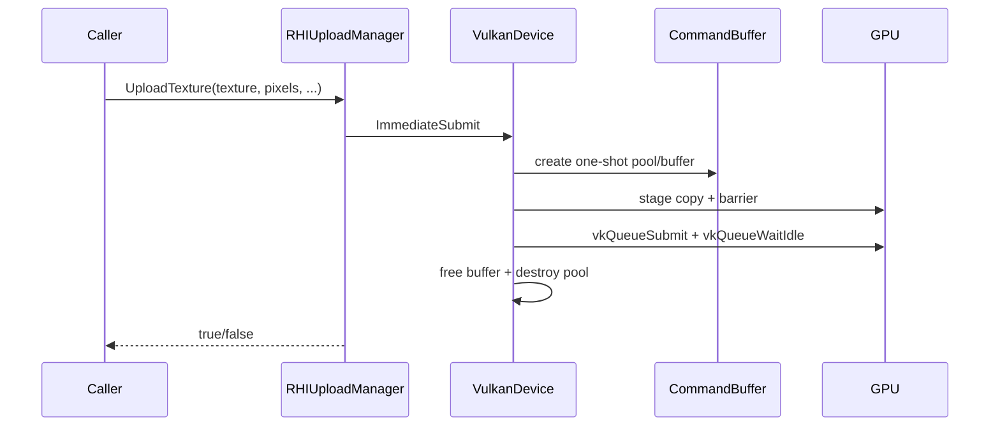

# RHIUploadManager

## 1. Role

Abstract interface for staging-buffer + immediate-submit uploads of
texture and buffer data. The interface is documented as blocking and
single-threaded. The Vulkan implementation is
`VulkanUploadManager`, which uses the device's `ImmediateSubmit` path
plus VMA staging memory.

## 2. Source Location

- Public header: `Engine/Source/Runtime/RHI/Public/XEngine/RHI/RHIUploadManager.h`
- Vulkan impl: `Engine/Source/Runtime/RHI/Private/Vulkan/VulkanUploadManager.{h,cpp}`

## 3. Owned State

The Vulkan impl owns staging-buffer templates allocated through VMA. Each
upload creates and destroys its own staging buffer + command buffer
inside the call.

## 4. Borrowed Dependencies

- `RHIDevice::ImmediateSubmit` for the one-shot submit and queue idle
  wait
  (`Engine/Source/Runtime/RHI/Private/Vulkan/VulkanDevice.cpp:775-818`).
- VMA allocator (held by the device).

## 5. Lifetime

The interface is owned by the device and exposed by reference through
`RHIDevice::GetUploadManager()`. The Vulkan impl is a `unique_ptr` on
the device, allocated during `VulkanDevice::Initialize`.

## 6. Callers and Used By

- `RenderTextureManager::CreateTextureFromAsset` uploads decoded
  pixel data.
- `RenderMeshManager::GetOrCreateMeshFromAsset` uploads vertex / index
  buffers.
- `RenderFrameResources::RebuildBindGroups` uploads the initial
  `GPUFrameData` value (seed) into the per-frame UBO.

## 7. Main Collaborators

- `RHIDevice` (for the immediate-submit path).
- `VulkanDevice::ImmediateSubmit`.

## 8. Runtime Sequence

## 9. Important Invariants

- Documented as **blocking** and **single-threaded** in the header.
- Must not be called inside an active command buffer recording session.
- Each upload completes before the function returns.

## 10. Invalid States and Failure Modes

- `ImmediateSubmit` failure (queue submit / wait idle) propagates as
  `false`.
- Staging buffer allocation failure propagates as `false`.

## 11. Threading and Synchronization Assumptions

- Designed for the main thread only.
- The on-GPU side observes a per-call `vkQueueSubmit + vkQueueWaitIdle`
  which guarantees no other work is in flight from the same queue while
  the upload runs. This is acceptable for editor / first-frame uploads
  but becomes a bottleneck under heavy streaming.

## 12. Design Rationale

- The blocking model keeps call sites simple: a `GetOrCreate*` function
  can rely on the texture being populated before it returns.
- A future async upload path can replace `ImmediateSubmit` with a
  transfer queue + fence + signal.

## 13. Alternatives and Trade-offs

- A dedicated transfer queue + timeline semaphores. Deferred to a future
  stage for non-blocking uploads.
- Persistent staging buffer pool. Rejected for V0 because of the
  small upload volume.

## 14. Extension Points

- A `Future<RHIUploadResult>` style API for non-blocking uploads.
- Staging buffer pool with offset management.

## 15. Current Limitations

- All uploads stall on `vkQueueWaitIdle`.
- No streamed multi-frame uploads.

## 16. Source References

- `Engine/Source/Runtime/RHI/Public/XEngine/RHI/RHIUploadManager.h:11-13`
- `Engine/Source/Runtime/RHI/Private/Vulkan/VulkanUploadManager.{h,cpp}`
- `Engine/Source/Runtime/RHI/Private/Vulkan/VulkanDevice.cpp:775-818`
