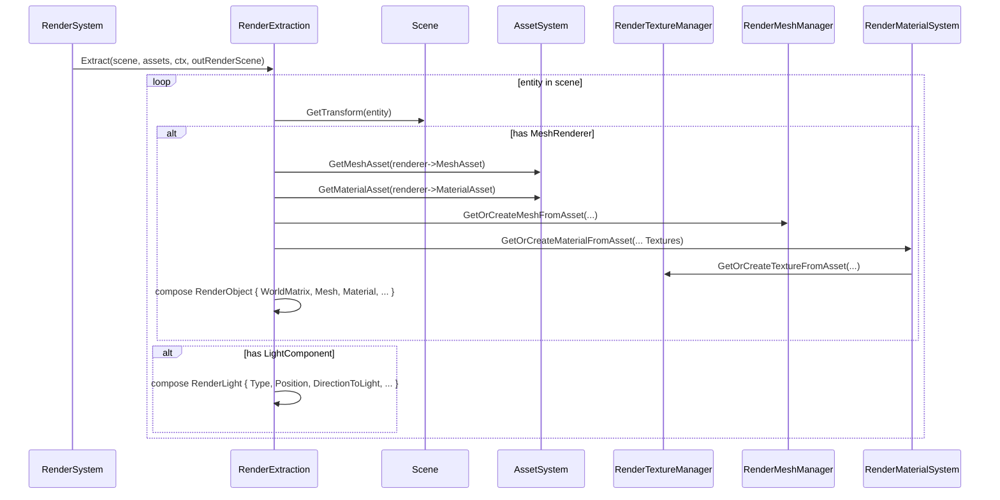

# RenderExtraction

## 1. Role

`RenderExtraction::Extract` is the **only** place where the runtime `Scene`
is converted into a render-side `RenderScene`. It walks every entity,
creates `RenderObject`s for those that have a `MeshRendererComponent`,
and creates `RenderLight`s for those that have a `LightComponent`. The
extraction also lazily builds GPU-side mesh + material resources by
calling into the renderer's managers.

## 2. Source Location

- `Engine/Source/Runtime/Renderer/Private/Scene/RenderExtraction.{h,cpp}`

## 3. Owned State

None. `Extract` is a static method.

## 4. Borrowed Dependencies

- `Scene` (read-only traversal).
- `AssetSystem` (through `GetMeshAsset`, `GetMaterialAsset`).
- `RenderResourceContext` (for the manager pointers needed to materialize
  textures, meshes, materials).
- `Math` helpers (`Normalize`, `TransformAABB`).

## 5. Lifetime

`Extract` produces `outRenderScene`, which is rebuilt every frame inside
`RenderSystem::Render`. The `RenderScene`'s `OpaqueObjects` vector is
cleared at the start of each call.

## 6. Callers and Used By

- `RenderSystem::Render` (the only caller).

## 7. Main Collaborators

- `RenderTextureManager` (lazily creates textures via
  `RenderMaterialSystem`).
- `RenderMeshManager` (lazily creates vertex / index buffers from
  `MeshAsset`).
- `RenderMaterialSystem` (lazily creates the GPU material record + bind
  groups from `MaterialAsset`).
- `RenderScene`, `RenderObject`, `RenderLight`, `GPULight`,
  `MeshRendererComponent`, `LightComponent`, `AssetSystem`.

## 8. Runtime Sequence

## 9. Important Invariants

- `DirectionToLight = Math::Normalize(-forward)` for directional lights;
  this is the vector the shader uses for `NdotL`.
- `ObjectId = entity.Index + 1u` so `0` is reserved as "invalid".
- A `MeshRendererComponent::Visible` flag is honored; invisible
  objects are skipped (no `RenderObject` emitted).
- A `LightComponent::Enabled` flag is honored.

## 10. Invalid States and Failure Modes

- Null `MeshAsset` or `MaterialAsset` -> skip the entity.
- Failed `GetOrCreateMeshFromAsset` or `GetOrCreateMaterialFromAsset`
  -> skip the entity. No error is logged here; the caller (pass) will
  see no `RenderObject` to draw.

## 11. Threading and Synchronization Assumptions

- Called from the main thread once per frame inside `RenderSystem::Render`.

## 12. Design Rationale

- A static, stateless function makes the extraction boundary explicit.
- The bridge is `Scene + AssetSystem -> RenderScene`. Asset and Scene
  do not depend on Renderer; this static function is the single point
  where the dependency is realized.

## 13. Alternatives and Trade-offs

- An asynchronous extraction pass. Deferred; the per-frame cost is
  acceptable for V0.

## 14. Extension Points

- New component types require new branches inside `Extract`.
- A future "render graph data request" interface lets passes pull
  custom data through the same boundary.

## 15. Current Limitations

- Only `MeshRendererComponent` and `LightComponent` are extracted.
- No LOD selection or material overrides.

## 16. Source References

- `Engine/Source/Runtime/Renderer/Private/Scene/RenderExtraction.cpp:30-116`
- `Engine/Source/Runtime/Renderer/Private/RenderSystem.cpp:150-158` (call site)
- `Engine/Source/Runtime/Renderer/Public/XEngine/Renderer/RenderScene.h`
- `Engine/Source/Runtime/Scene/Public/XEngine/Scene/Components/*.h`
