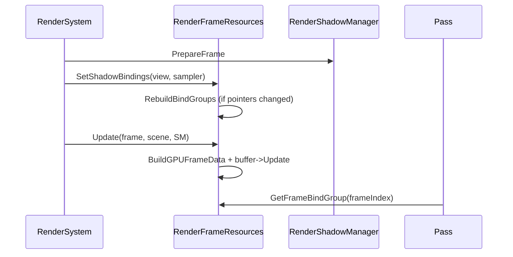

# RenderFrameResources

## 1. Role

`RenderFrameResources` owns the per-frame `GPUFrameData` UBO ring
(three buffers), the matching bind groups (Set 0 binding 0 = UBO,
binding 1 = sampled shadow texture, binding 2 = shadow sampler), and an
optional placeholder shadow texture/view/sampler pair used until the
shadow cache produces real resources.

## 2. Source Location

- `Engine/Source/Runtime/Renderer/Private/Resources/RenderFrameResources.h`
- `Engine/Source/Runtime/Renderer/Private/Resources/RenderFrameResources.cpp`

## 3. Owned State

```cpp
RHIDevice*                                    m_Device = nullptr;
std::shared_ptr<RHIBindGroupLayout>           m_FrameBindGroupLayout;
std::shared_ptr<RHIBindGroupLayout>           (no second layout; preserved for planned shadow cascade UBO);
std::array<std::shared_ptr<RHIBuffer>, RendererMaxFramesInFlight> m_FrameBuffers;       // 3
std::array<std::shared_ptr<RHIBindGroup>, RendererMaxFramesInFlight> m_FrameBindGroups;  // 3
RHITextureView*                               m_ShadowSampledView = nullptr;
RHISampler*                                   m_ShadowSampler     = nullptr;
std::shared_ptr<RHITexture>                   m_PlaceholderShadowTexture;
std::shared_ptr<RHITextureView>               m_PlaceholderShadowView;
std::shared_ptr<RHISampler>                   m_PlaceholderShadowSampler;
bool                                          m_HasRealShadow = false;
```

```cpp
static constexpr u32 RendererMaxFramesInFlight = 3;
```

## 4. Borrowed Dependencies

- The current `RHIDevice*` (passes through to the resource factory).
- `RHITextureView*` and `RHISampler*` from the shadow subsystem
  (acquired via constructor pointer or `SetShadowBindings`).

## 5. Lifetime

- `Initialize` constructs the bind-group layout (binding 0 uniform buffer,
  binding 1 sampled texture, binding 2 sampler).
- It also calls `CreatePlaceholderShadow` lazily when no shadow resources
  have been supplied. The placeholder is a 1x1 D32 texture whose depth
  read returns 1.0 under a reverse-Z comparison, so the forward pass
  renders the scene fully lit until real cascades exist.
- Per-frame UBO updates happen inside `Update(frame, scene, shadow)`.
- `RebuildBindGroups` rebuilds all 3 frame bind groups from current
  shadow references.
- `Shutdown` releases 3 buffers and 3 bind groups, then drops the
  placeholder.

## 6. Callers and Used By

- `RenderSystem::OnCreate` constructs and initializes
  `RenderFrameResources` after `RenderShadowManager::Initialize`.
- `RenderSystem::Render` calls `SetShadowBindings` and `Update`.
- `ForwardOpaquePass::Execute` calls `GetFrameBindGroup` to bind Set 0.

## 7. Main Collaborators

- `RenderShadowManager` (source of real shadow sampled view/sampler).
- `RHIResourceFactory` (bind-group layout, buffers, bind groups).
- `RHIUploadManager` (seed upload of initial `GPUFrameData`).

## 8. Runtime Sequence



## 9. Important Invariants

- The Set-0 bind-group layout is exactly:
  - binding 0: UniformBuffer, vertex + fragment visible.
  - binding 1: SampledTexture, fragment visible.
  - binding 2: Sampler, fragment visible.
- `SetShadowBindings` short-circuits when the new pair already matches,
  avoiding unnecessary bind-group rebuilds.
- The renderer-side frame-in-flight count (`RendererMaxFramesInFlight = 3`)
  does not currently match the RHI backend single-frame-in-flight policy;
  see `Docs/Architecture/07_Frames_In_Flight_And_GPU_Synchronization.md`.

## 10. Invalid States and Failure Modes

- `Initialize` fails when the device is null or the bind-group layout
  creation fails; the renderer will skip frame resources in that case.
- `SetShadowBindings` keeps raw pointers; caller must guarantee they
  outlive the renderer.
- `Update` warns when the underlying buffer is missing.

## 11. Threading and Synchronization Assumptions

- All methods are called from the main thread.
- Per-frame UBO buffer writes are CPU-only; the GPU reads from these
  buffers at command-buffer submission time. Single-frame-in-flight
  policy at the RHI level eliminates races.

## 12. Design Rationale

- A small ring of UBOs matches typical double-buffering without
  introducing true multi-frame-in-flight semantics for V0.
- Placeholder shadow resources keep the bind group non-null while the
  shadow subsystem's cache is being created.

## 13. Alternatives and Trade-offs

- A single shared Set-0 bind group. Rejected: per-frame indexing is
  the right shape for future async compute.
- Embedding shadow bind groups into `RenderShadowManager`. Rejected to
  keep shadow resources owned by their cache.

## 14. Extension Points

- Set-1 and Set-2 bind groups (currently routed through
  `RenderMaterialSystem`).
- Add a dedicated cascade UBO at Set 0 binding 3 if the
  shadow depth shader ever needs per-cascade uniforms (the vertex-only
  shadow depth pass currently relies on push constants only).

## 15. Current Limitations

- Frame ring mismatch with the RHI backend.
- `SetShadowBindings` contains dead debug printing at
  `RenderFrameResources.cpp:109-110`.

## 16. Source References

- `Engine/Source/Runtime/Renderer/Private/Resources/RenderFrameResources.{h,cpp}`
- `Engine/Source/Runtime/Renderer/Private/RenderSystem.cpp:259-271` (Update call site)
- `Engine/Source/Runtime/Renderer/Private/Passes/ForwardOpaquePass.cpp:50` (consumer)
- `Engine/Shaders/Common/Types.slang` (shader-side mirror struct)
