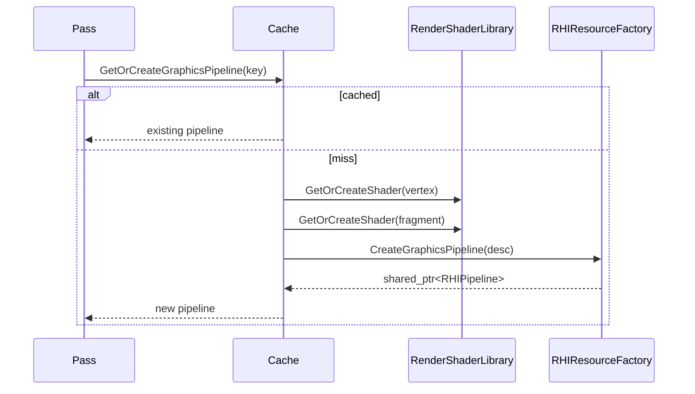

# RenderPipelineStateCache

## 1. Role

Caches `RHIPipeline` instances keyed by `GraphicsPipelineStateKey`. It is
the single source of "which GPU pipeline corresponds to which pass / material
combination".

## 2. Source Location

- Header: `Engine/Source/Runtime/Renderer/Private/Resources/RenderPipelineStateCache.h`
- Implementation: `Engine/Source/Runtime/Renderer/Private/Resources/RenderPipelineStateCache.cpp`
- Key struct: `Engine/Source/Runtime/Renderer/Private/Resources/GraphicsPipelineStateKey.h`

## 3. Owned State

```cpp
RHIDevice*                       m_Device = nullptr;
RenderShaderLibrary*             m_ShaderLibrary = nullptr;
RenderMaterialSystem*            m_MaterialSystem = nullptr;
RenderFrameResources*            m_FrameResources = nullptr;
std::unordered_map<GraphicsPipelineStateKey, std::shared_ptr<RHIPipeline>, GraphicsPipelineStateKeyHash> m_GraphicsPipelines;
```

## 4. Borrowed Dependencies

- `RHIDevice*` (passed in at initialization).
- `RenderShaderLibrary*` and `RenderMaterialSystem*` (passed in at
  initialization; used to fetch shaders + material bind-group layouts).
- `RenderFrameResources*` (passed in at initialization; provides the
  shadow bind group layout for `ShadowDepth` pipelines).

## 5. Lifetime

`Initialize` only saves the pointers and logs a message. Pipelines are
created lazily on first request; they stay alive for the lifetime of the
cache. `Shutdown` clears the cached pipelines and resets pointers.

## 6. Callers and Used By

- `ForwardOpaquePass::Execute` builds a `GraphicsPipelineStateKey` per
  object and calls `GetOrCreateGraphicsPipeline`.
- `ShadowDepthPass::Execute` calls `GetOrCreateShadowDepthPipeline` once
  per cascade; the cache deduplicates based on the
  `(colorFormat, depthFormat)` pair.
- `RenderSystem::OnCreate` calls `Initialize` after the dependent managers
  are ready.

## 7. Main Collaborators

- `RenderShaderLibrary` (provides vertex/fragment shaders).
- `RenderMaterialSystem` (provides the PBR material bind-group layout
  used by forward passes).
- `RenderFrameResources` (provides the shadow bind-group layout used
  by the shadow depth pass).
- `RHIResourceFactory::CreateGraphicsPipeline` (actual creation).

## 8. Runtime Sequence



## 9. Important Invariants

- `key.PassKind` is `ForwardOpaque` or `ShadowDepth`; any other value
  results in `{}`.
- The key hash treats `-0.0` and `0.0` as identical (line 56 of
  `GraphicsPipelineStateKey.h`); adjust if that becomes a problem.
- The cache relies on the `RHIResourceFactory::CreateGraphicsPipeline`
  push-constant guard in `VulkanPipeline.cpp`.

## 10. Invalid States and Failure Modes

- `CreateGraphicsPipeline` returning null leaves the cache unable to
  fulfil a future request; the pass's `if (depthPipeline == nullptr)
  continue` will skip work for that object.
- `ShadowDepthPushConstants` is currently 144 bytes on the live
  `main` branch; the cache relies on the RHI backend's push-constant
  size guard for safety.

## 11. Threading and Synchronization Assumptions

- All public methods are intended for the main thread.

## 12. Design Rationale

- A flat unordered map keyed by struct + hash avoids spawning a custom
  comparator class.
- Two entry points (`ForwardOpaque` keys; `ShadowDepth` colour/depth
  pair) cleanly separate cache strategies.

## 13. Alternatives and Trade-offs

- A per-shader-program cache (no fixed key). Rejected: pipeline
  variability comes from layout + format combos, not just shader
  permutations.
- A graphics-pipeline blob serialization. Deferred.

## 14. Extension Points

- New `RenderPassKind` enum values enable additional passes.
- `PipelineLayoutVersion` provides a generation number that can be
  bumped when a Set layout changes.

## 15. Current Limitations

- 144-byte `ShadowDepthPushConstants` exceeds the spec-minimum
  `maxPushConstantsSize` on Intel Iris Xe and triggers the guard in
  `VulkanPipeline.cpp`. The fix is to move `LightViewProjection` into
  a UBO; tracked separately.

## 16. Source References

- `Engine/Source/Runtime/Renderer/Private/Resources/RenderPipelineStateCache.{h,cpp}`
- `Engine/Source/Runtime/Renderer/Private/Resources/GraphicsPipelineStateKey.h`
- `Engine/Source/Runtime/Renderer/Private/Resources/RenderShaderTypes.h`
- `Engine/Source/Runtime/RHI/Private/Vulkan/VulkanPipeline.cpp`
