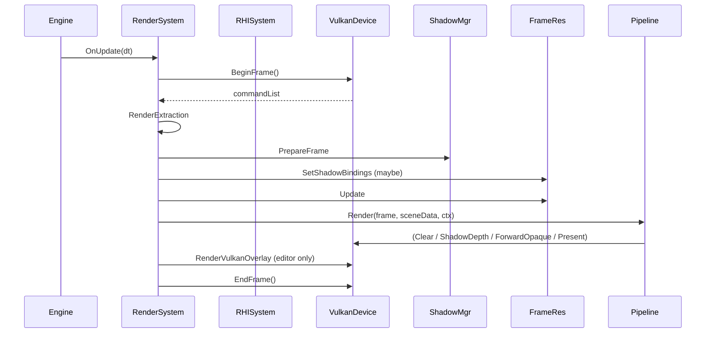

# RenderSystem

## 1. Role

`RenderSystem` is the engine subsystem that owns and coordinates every
renderer-side long-lived manager, exposes the public hooks
(`SetOverlayCallback`, `SetViewProvider`, `SetOutputProvider`,
`GetDebugSettings`, `GetSettings`), and drives the per-frame `Render()`
call that runs the active pipeline.

## 2. Source Location

- `Engine/Source/Runtime/Renderer/Public/XEngine/Renderer/RenderSystem.h`
- `Engine/Source/Runtime/Renderer/Private/RenderSystem.cpp`
- The struct `Impl` is defined inline in the cpp at
  `Renderer/Private/RenderSystem.cpp:38-67`.

## 3. Owned State

`Impl` fields:

```cpp
Engine*                        EngineInstance;
RHISystem*                     RHI;
ShaderSystem*                  Shader;
AssetSystem*                   Assets;
SceneSystem*                   Scenes;

std::unique_ptr<RenderTextureManager>    Textures;
std::unique_ptr<RenderMeshManager>       Meshes;
std::unique_ptr<RenderMaterialSystem>    Materials;
std::unique_ptr<RenderShaderLibrary>     Shaders;
std::unique_ptr<RenderFrameResources>    FrameResources;
std::unique_ptr<RenderPipelineStateCache> PipelineStates;
std::unique_ptr<RenderShadowManager>     ShadowManager;

RenderResourceContext          Resources;     // populated with raw pointers
std::unique_ptr<RenderPipeline> ActivePipeline;
RenderScene                    SceneData;     // rebuilt each frame
RendererDebugSettings          DebugSettings;
std::function<void()>          OverlayCallback;
std::function<bool(RenderView&)> ViewProvider;
std::function<bool(RHIRenderOutputDesc&)> OutputProvider;
RendererSettings               m_RendererSettings;
Mat4                           FallbackViewProjection { 1.0f };
u32                            SwapchainWidth = 1280;
u32                            SwapchainHeight = 720;
bool                           Initialized = false;
```

## 4. Borrowed Dependencies

- `Engine*`, `RHISystem*`, `ShaderSystem*`, `AssetSystem*`,
  `SceneSystem*` - borrowed from `SubsystemManager`.
- `RHIDevice*` - borrowed from `RHISystem` (acquired via
  `RHISystem::GetDevice()` once per frame inside `Render`).

## 5. Lifetime

`OnCreate` runs once when `Engine::Initialize` registers the subsystem; its
sequence is fixed (see
`Docs/Architecture/03_Ownership_And_Lifetime.md`). `OnDestroy` reverses the
order:

```cpp
ActivePipeline->Shutdown();
FrameResources->Shutdown();
PipelineStates->Shutdown();
ShadowManager->Shutdown();
Shaders->Shutdown();
Materials->Shutdown();
Meshes->Shutdown();
Textures->Shutdown();
Resources = {};
SceneData.Clear();
Scenes = nullptr;
Assets = nullptr;
Shader = nullptr;
RHI = nullptr;
EngineInstance = nullptr;
Initialized = false;
```

## 6. Callers and Used By

- `SubsystemManager` (via the subsystem interface).
- `Engine::Run` drives `OnUpdate(dt)` which calls `m_Impl->Render(dt)`.
- Apps and Editor hold the only public handles; they bind the lambda
  callbacks through `SetOverlayCallback / SetViewProvider / SetOutputProvider`.

## 7. Main Collaborators

- `ForwardRenderPipeline` (currently the only `RenderPipeline` subclass).
- The seven persistent managers.
- `RHISystem` and `VulkanDevice`.

## 8. Runtime Sequence



## 9. Important Invariants

- Manager construction order is strict: `Textures -> Meshes -> Materials -> Shaders -> ShadowManager -> FrameResources -> PipelineStates -> ActivePipeline`.
- `ShadowManager::Initialize` must precede `FrameResources::Initialize`,
  because the latter picks up the shadow sampled view / sampler pointers
  during init.
- The active pipeline receives its raw `RenderResourceContext` already
  populated; do not construct pipeline before wiring pointers.

## 10. Invalid States and Failure Modes

- `OnCreate` short-circuits and logs "RenderSystem requires RHIDevice and
  ShaderSystem" if either subsystem is missing or device is invalid.
- `Render()` returns early if not initialized.
- `RenderSystem::Shutdown` is idempotent; calling it twice is safe.

## 11. Threading and Synchronization Assumptions

- `OnCreate`, `OnDestroy`, and `OnUpdate` are all called from the main
  thread by `Engine::Run`. There is no internal thread synchronization.
- `SetOverlayCallback / SetViewProvider / SetOutputProvider` are intended
  to be called from the main thread before the engine starts ticking.
  Calling them mid-frame is not part of the contract.

## 12. Design Rationale

- A single subsystem provides clean lifecycle integration with the
  Engine class.
- A PIMPL struct keeps the seven managers and the per-frame state out of
  the public header.
- The lambda callbacks let the Editor override the camera, render
  output, and overlay without modifying renderer code.

## 13. Alternatives and Trade-offs

- The view / projection logic could live inside a dedicated subsystem;
  current location is a known smell (see
  `Docs/Architecture/02_Frame_Runtime_Flow.md` notes).
- RenderSystem could be split into per-frame and per-resource subsystems;
  the current single-class layout fits V0's coordination model.

## 14. Extension Points

- `ViewProvider` and `OutputProvider` are the public extension points
  for camera and render target overrides.
- New persistent managers must be wired into both `OnCreate` and `Shutdown`
  in lockstep.

## 15. Current Limitations

- 150-line `Render()` with seven distinct responsibilities; helper
  extraction is pending.
- No protection against setting `OutputProvider` mid-frame.

## 16. Source References

- `Engine/Source/Runtime/Renderer/Public/XEngine/Renderer/RenderSystem.h`
- `Engine/Source/Runtime/Renderer/Private/RenderSystem.cpp:38-67, 131-284, 297-397`
- `Engine/Source/Runtime/Engine/Private/Engine.cpp:48-122` (subsystem order)
- `Engine/Source/Runtime/RHI/Private/RHIDevice.cpp` (RHISystem integration)
