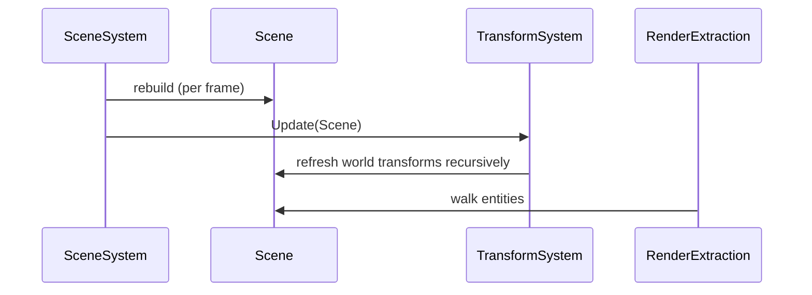

# Scene

## 1. Role

`Scene` is the engine-side entity/component graph. Holds entities, their
components (`TransformComponent`, `MeshRendererComponent`,
`CameraComponent`, `LightComponent`, optional `NameComponent`), the
parent/child hierarchy, and provides lookup APIs.

## 2. Source Location

- `Engine/Source/Runtime/Scene/Public/XEngine/Scene/Scene.h`
- `Engine/Source/Runtime/Scene/Private/Scene.cpp`

## 3. Owned State

```cpp
// (logical shape; full field set in Scene.h)
std::unordered_map<Entity, std::unique_ptr<TransformComponent>> m_Transforms;
std::unordered_map<Entity, std::unique_ptr<MeshRendererComponent>> m_MeshRenderers;
std::unordered_map<Entity, std::unique_ptr<CameraComponent>> m_Cameras;
std::unordered_map<Entity, std::unique_ptr<LightComponent>> m_Lights;
std::unordered_map<Entity, std::unique_ptr<NameComponent>> m_Names;
std::unordered_map<u32, Entity> m_Parents;                          // child -> parent
std::unordered_map<u32, std::vector<Entity>> m_Children;            // parent -> children
std::vector<Entity> m_RootEntities;
```

## 4. Borrowed Dependencies

- `TransformSystem` (per-frame update; called externally by
  `SceneSystem::OnUpdate`).

## 5. Lifetime

- A `Scene` instance lives inside `SceneSystem::m_ActiveScene`.
- Entities are inserted with stable `Entity { u32 Index, u32 Generation }`
  handles. `Generation` is bumped on destroy to make stale handles
  detectable.

## 6. Callers and Used By

- `SceneSystem` (owned by Engine, owns the active scene).
- `TransformSystem::Update(scene)` (per-frame hierarchy / world-matrix
  update).
- `RenderExtraction::Extract(scene, ...)` (read-only consumer).
- `SceneSerializer` (load/save).

## 7. Main Collaborators

- `Entity`, `TransformComponent`, `MeshRendererComponent`,
  `CameraComponent`, `LightComponent`, `NameComponent`.
- `TransformSystem`, `DebugCameraController`.

## 8. Runtime Sequence



## 9. Important Invariants

- `Entity::Generation` distinguishes alive vs reused handle slots.
- World matrix cache is part of `TransformComponent`; it is dirty
  when local state or hierarchy changes.
- `m_RootEntities` is the traversal root (does not correspond to a
  real entity).
- `CameraComponent::Primary` selects exactly one primary camera
  through `SceneSystem::GetPrimaryCamera`.

## 10. Invalid States and Failure Modes

- Repeated destroy/create of the same `Index` increments
  `Generation`. Stale handles (`Index + old Generation`) are detectable
  by callers but the current code does not assert on this.
- A `Scene` with no `TransformComponent` on an entity returns
  `nullptr` from `GetTransform`; consumers must check.

## 11. Threading and Synchronization Assumptions

- Single-threaded; called from the main thread only.

## 12. Design Rationale

- Components live with the entity in flat maps; lookup is fast and
  pointer stable.
- Hierarchy is stored as `parent -> children` plus `child ->
  parent`, so upward and downward traversals are both O(1).

## 13. Alternatives and Trade-offs

- ECS-style storage (packed arrays per component type). Rejected for
  V0 because entity count is small.
- Per-thread scenes. Deferred.

## 14. Extension Points

- Add new component types by following the existing pattern: a
  `Components/FooComponent.h`, a storage map in `Scene`, and a
  `Get/AddFooComponent` API.
- Add new system classes by adding to `Private/Systems/`.

## 15. Current Limitations

- `NameComponent` is a placeholder.
- No prefab / instance support.

## 16. Source References

- `Engine/Source/Runtime/Scene/Public/XEngine/Scene/Scene.h`
- `Engine/Source/Runtime/Scene/Private/Scene.cpp`
- `Engine/Source/Runtime/Scene/Public/XEngine/Scene/Components/*.h`
- `Engine/Source/Runtime/Scene/Private/Systems/TransformSystem.cpp`
- `Engine/Source/Runtime/Scene/Public/XEngine/Scene/SceneSystem.h`
