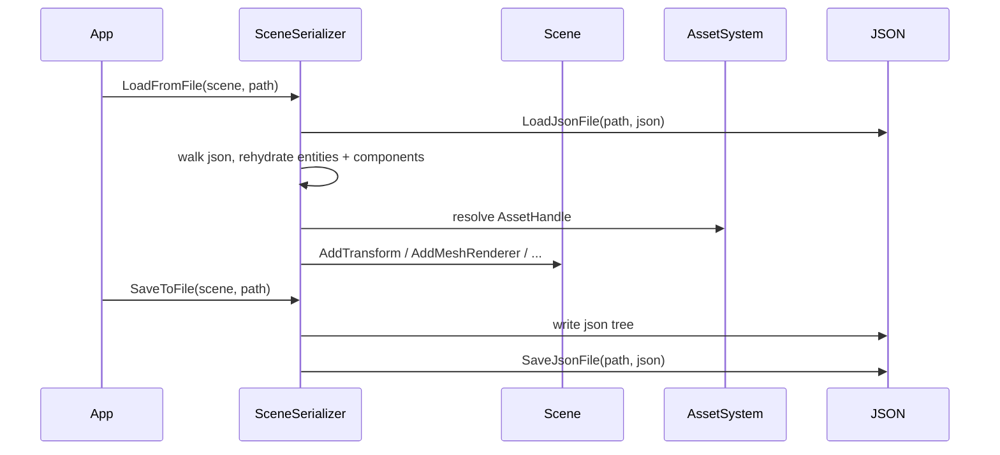

# SceneSerializer

## 1. Role

JSON round-trip for the `Scene` module. Reads and writes `.xscene`
files through `SerializationContext { AssetSystem* }`. Currently used
only by the Sandbox app at startup.

## 2. Source Location

- Header: `Engine/Source/Runtime/Scene/Public/XEngine/Scene/SceneSerializer.h`
- Implementation: `Engine/Source/Runtime/Scene/Private/Serialization/SceneSerializer.cpp`

## 3. Owned State

```cpp
SerializationContext m_Context;  // carries AssetSystem*
```

## 4. Borrowed Dependencies

- `SerializationContext` carries the active `AssetSystem*` so asset
  handles can be resolved.
- `Scene` is mutated when loading; the serializer borrows it
  non-owning.

## 5. Lifetime

Constructed with a `SerializationContext`. `LoadFromFile` and
`SaveToFile` are short-lived calls that read/write the entire scene.

## 6. Callers and Used By

- `Apps/Sandbox/Source/main.cpp` constructs the context and calls
  `LoadFromFile` during startup.
- (Future) `EditorSystem` may call `SaveToFile` for editor save.

## 7. Main Collaborators

- `Serialization` module (`LoadJsonFile`, `SaveJsonFile`).
- `AssetSystem` (for asset handle resolution on load).
- `Scene`, `Entity`, components.

## 8. Runtime Sequence



## 9. Important Invariants

- The on-disk format is versioned by `XSceneSerializationVersion`.
  Mismatched versions should warn rather than silently fail.
- Asset references in scenes are stored as `AssetHandle`s (the
  numerical handle), not paths.

## 10. Invalid States and Failure Modes

- Failed `LoadJsonFile` -> `LoadFromFile` returns false; the
  caller (Sandbox) logs and continues with an empty scene.
- Missing assets at load time -> the asset handle resolves to null
  on lookup; the entity's `MeshRendererComponent` becomes
  unusable but the scene still loads.

## 11. Threading and Synchronization Assumptions

- Synchronous, main-thread only.

## 12. Design Rationale

- A single class with a single context decouples load/save from any
  larger serialization infrastructure.
- JSON keeps the format debug-friendly for the V0 stage.

## 13. Alternatives and Trade-offs

- Binary serialization. Deferred; the round-trip is not a hot path.

## 14. Extension Points

- Version-bump handling when the schema changes.
- Round-trip through `Scene.h::GetComponents` once a richer
  iterator is available.

## 15. Current Limitations

- No diffing; full save each time.
- No partial loads.

## 16. Source References

- `Engine/Source/Runtime/Scene/Private/Serialization/SceneSerializer.cpp`
- `Engine/Source/Runtime/Serialization/Public/XEngine/Serialization/SerializationVersion.h`
- `Engine/Source/Runtime/Asset/Public/XEngine/Asset/AssetSystem.h`
