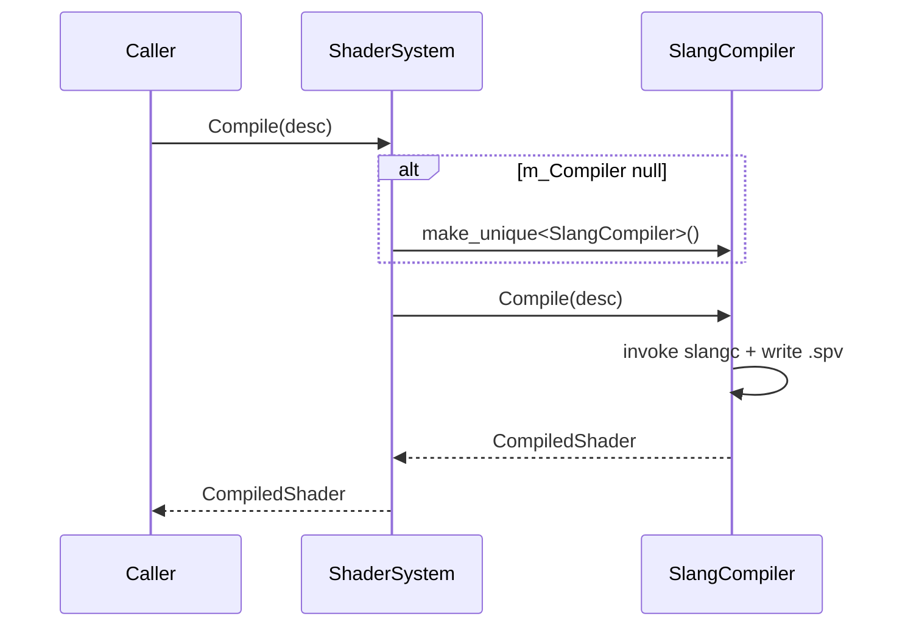

# ShaderSystem

## 1. Role

Engine subsystem that owns shader compilation. Backed by
`SlangCompiler` which shells out to the bundled `slangc` executable.
Caches output under `Saved/Cache/Shaders/Vulkan/`.

## 2. Source Location

- Header: `Engine/Source/Runtime/Shader/Public/XEngine/Shader/ShaderSystem.h`
- Implementation: `Engine/Source/Runtime/Shader/Private/ShaderSystem.cpp`
- Compiler: `Engine/Source/Runtime/Shader/Private/Slang/SlangCompiler.{h,cpp}`
- Reflection helper: `Engine/Source/Runtime/Shader/Private/Slang/SlangReflection.cpp`

## 3. Owned State

```cpp
std::unique_ptr<ShaderCompiler> m_Compiler;
```

## 4. Borrowed Dependencies

- `SlangCompiler` (constructed lazily when the subsystem is enabled).

## 5. Lifetime

Constructed by `Engine::Initialize`. `m_Compiler` is allocated on first
compile if not already set.

## 6. Callers and Used By

- `RenderShaderLibrary` -> `ShaderSystem::Compile(ShaderCompileDesc)`.

## 7. Main Collaborators

- `ShaderCompiler`, `SlangCompiler`, `CompiledShader`, `ShaderModule`.

## 8. Runtime Sequence



## 9. Important Invariants

- Compiler state is the only mutable state; the rest is value-passed.
- A failed compile populates `CompiledShader::Diagnostics` and
  reports `IsValid()` as false; cache files may be left stale.

## 10. Invalid States and Failure Modes

- Slang not available: `IsCompilerAvailable()` returns false; `Compile`
  returns `ShaderCompileResult::CompilerUnavailable`.

## 11. Threading and Synchronization Assumptions

- Main-thread only.

## 12. Design Rationale

- Shelling out keeps the runtime small and avoids linking the Slang
  library into the executable.
- Cache files under `Saved/Cache` survive rebuilds.

## 13. Alternatives and Trade-offs

- Linked Slang runtime. Rejected for the runtime footprint.

## 14. Extension Points

- A different `ShaderCompiler` backend (e.g. SPIR-V cross-compiler).

## 15. Current Limitations

- Only Slang.
- Reflection data captured but not yet consumed by the renderer.

## 16. Source References

- `Engine/Source/Runtime/Shader/Public/XEngine/Shader/ShaderSystem.h`
- `Engine/Source/Runtime/Shader/Private/ShaderSystem.cpp`
- `Engine/Source/Runtime/Shader/Private/Slang/SlangCompiler.cpp`
