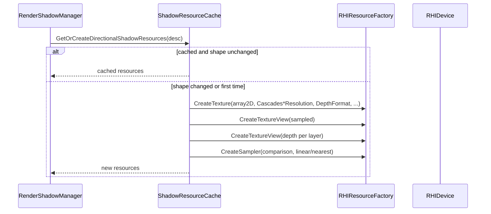

# ShadowResourceCache

## 1. Role

Lazily allocates and stores the directional shadow texture array, the
sampled view, the per-layer depth views, and the comparison sampler.
Reproduces the same `DirectionalShadowResources` whenever the shape
parameters change; otherwise returns the cached set.

## 2. Source Location

- `Engine/Source/Runtime/Renderer/Private/Shadows/ShadowResourceCache.{h,cpp}`

## 3. Owned State

```cpp
struct DirectionalShadowResources {
    std::shared_ptr<RHITexture> Texture;
    std::shared_ptr<RHITextureView> SampledView;
    std::array<std::shared_ptr<RHITextureView>, MaxShadowCascades> LayerDepthViews;
    std::shared_ptr<RHISampler> Sampler;
    u32 CascadeCount;
    u32 Resolution;
    RHIFormat Format;
};

// (cache) singleton of DirectionalShadowResources keyed by DirectionalShadowResourceDesc.
```

## 4. Borrowed Dependencies

- `RHIDevice*` (passed in `Initialize` and used to create /
  re-create resources).

## 5. Lifetime

- `Initialize(device)` saves the device pointer.
- `GetOrCreateDirectionalShadowResources(desc)` returns the cache or
  rebuilds. On shape change (resolution, cascade count, format,
  storage mode) the previous resources are dropped and a new set is
  created through the resource factory.
- `Shutdown` clears the cache.

## 6. Callers and Used By

- `RenderShadowManager::PrepareDirectionalShadow` (only caller).

## 7. Main Collaborators

- `RHIResourceFactory` (creates the cascade array texture, sampled
  views, per-layer views, comparison sampler).
- `RenderShadowType.h` (definitions).

## 8. Runtime Sequence



## 9. Important Invariants

- The cascade array and the sampled view are kept in sync: the array is
  rebuilt and the sampled view recreated in lockstep.
- The per-layer depth views are `Texture2DArray` depth attachments.
- The sampler is a comparison sampler (PCF-friendly).

## 10. Invalid States and Failure Modes

- A texture/sampler creation failure inside
  `GetOrCreateDirectionalShadowResources` returns an empty result;
  the manager treats that as "no shadows this frame".

## 11. Threading and Synchronization Assumptions

- Main-thread only.

## 12. Design Rationale

- Lazy allocation avoids creating a shadow array until the scene has a
  directional cast-shadow light.
- A cache keyed by shape parameters keeps reuse simple and avoids
  complicated invalidation logic.

## 13. Alternatives and Trade-offs

- Tiered/allocation tracking. Deferred.
- Texture compression. Deferred.

## 14. Extension Points

- Add a separate per-light cache by changing the key to include
  `DirectionalShadowResourceDesc::LightIndex`.
- Add a default placeholder texture used during the first frame.

## 15. Current Limitations

- One array total across the engine lifetime.
- No hot-reload of cascade resolution.

## 16. Source References

- `Engine/Source/Runtime/Renderer/Private/Shadows/ShadowResourceCache.{h,cpp}`
- `Engine/Source/Runtime/Renderer/Private/Shadows/RenderShadowType.h`
- `Engine/Source/Runtime/RHI/Private/Vulkan/VulkanTexture.cpp` (cascade array)
