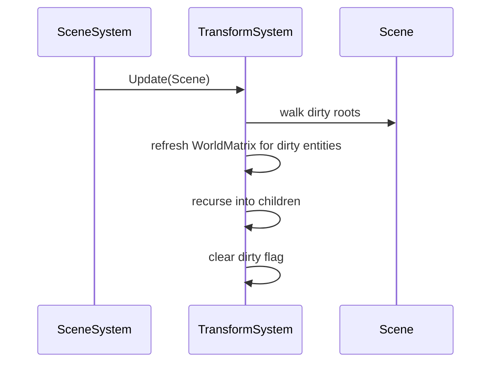

# TransformSystem

## 1. Role

Per-frame hierarchy / world transform updater. Walks every entity with a
`TransformComponent`, refreshes its cached world matrix when dirty,
recurses into children, and resets the dirty flag.

## 2. Source Location

- `Engine/Source/Runtime/Scene/Public/XEngine/Scene/Components/TransformComponent.h`
- `Engine/Source/Runtime/Scene/Private/Systems/TransformSystem.{h,cpp}`

## 3. Owned State

Stateless. All state lives in `TransformComponent` itself (LocalPosition /
LocalRotation / LocalScale, WorldPosition / WorldRotation / WorldScale,
WorldMatrix, LocalMatrix, Dirty).

## 4. Borrowed Dependencies

- `Math::ComposeTRS` and related transforms from Foundation.

## 5. Lifetime

Called every frame inside `SceneSystem::OnUpdate` (the per-tick subsystem
update). No construction arguments; default-constructible.

## 6. Callers and Used By

- `SceneSystem::OnUpdate` (only caller).
- `RenderExtraction::Extract` reads `WorldMatrix` from each
  `TransformComponent`.

## 7. Main Collaborators

- `TransformComponent`, `Scene`, `SceneSystem`.

## 8. Runtime Sequence

## 9. Important Invariants

- The world matrix cache is per-component; once updated, the dirty
  flag is cleared until the next local setter.
- Hierarchy changes must mark the parent's child subtree dirty;
  the system does not automatically detect this without explicit
  `SetParent` calls.

## 10. Invalid States and Failure Modes

- An entity without a `TransformComponent` is silently skipped.
- A circular parent reference would cause infinite recursion; the
  public `SetParent` API is responsible for rejecting cycles.

## 11. Threading and Synchronization Assumptions

- Main-thread only.

## 12. Design Rationale

- A friend-on-TransformComponent API keeps the cache fields
  synchronized without runtime cost.
- Recursive updates are fine for typical hierarchies (tens of
  thousands of objects is well within budget).

## 13. Alternatives and Trade-offs

- Flattened hierarchy walked in scene order. Not currently done.
- Per-system update of unselected objects. Deferred.

## 14. Extension Points

- Add explicit `MarkDirty` helpers when adding new mutation paths.
- Add worker-thread parallel walking when the scene grows.

## 15. Current Limitations

- No parallelization.
- No LOD-driven transform updates.

## 16. Source References

- `Engine/Source/Runtime/Scene/Private/Systems/TransformSystem.{h,cpp}`
- `Engine/Source/Runtime/Scene/Public/XEngine/Scene/Components/TransformComponent.h`
- `Engine/Source/Runtime/Scene/Public/XEngine/Scene/SceneSystem.h`
