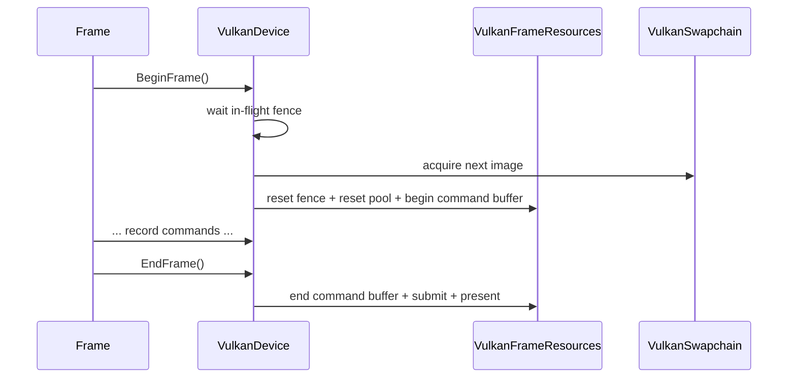

# VulkanDevice

## 1. Role

`VulkanDevice` is the concrete `RHIDevice` implementation. It owns the
Vulkan instance, surface, physical/logical device, graphics and present
queues, VMA allocator, descriptor pool, swapchain, depth target, frame
resources, command list, resource factory, upload manager, and resize /
present logic.

## 2. Source Location

- `Engine/Source/Runtime/RHI/Private/Vulkan/VulkanDevice.{h,cpp}`

## 3. Owned State

Members declared in `VulkanDevice.h`:

```cpp
VulkanInstance              m_Instance;
VulkanSurface               m_Surface;
VulkanAllocator             m_Allocator;
VulkanSwapchain             m_Swapchain;
VulkanFrameResources        m_FrameResources;
VulkanCommandList           m_CommandList;
VkPhysicalDevice            m_PhysicalDevice = VK_NULL_HANDLE;
VkDevice                    m_Device        = VK_NULL_HANDLE;
VkDescriptorPool            m_DescriptorPool = VK_NULL_HANDLE;
VulkanQueue                 m_GraphicsQueue;
VulkanQueue                 m_PresentQueue;
std::shared_ptr<RHITexture> m_DepthTexture;
std::shared_ptr<RHITextureView> m_DepthTextureView;
std::unique_ptr<VulkanResourceFactory> m_ResourceFactory;
std::unique_ptr<VulkanUploadManager>   m_UploadManager;
RHICapabilities             m_Capabilities;
bool                        m_Initialized    = false;
bool                        m_EnableVSync    = false;
bool                        m_FrameActive    = false;
VkCommandBuffer             m_CurrentCommandBuffer;
u32                         m_CurrentImageIndex = 0;
VkImageLayout               m_CurrentSwapchainImageLayout = VK_IMAGE_LAYOUT_UNDEFINED;
bool                        m_ResizeRequested      = false;
u32                         m_PendingResizeWidth  = 0;
u32                         m_PendingResizeHeight = 0;
```

## 4. Borrowed Dependencies

- `NativeWindowHandle` and `WindowDesc` from the Platform module
  (passed in as `VulkanDeviceCreateInfo::NativeWindow`).
- `VulkanInstance` produces the `VkInstance`; `VulkanSurface` consumes it.
- `VulkanSurface::GetRequiredInstanceExtensions()` is called by
  `VulkanDevice::Initialize` to populate the instance extension list.

## 5. Lifetime

Constructed when `RHISystem::OnCreate` instantiates it. Initialized by
`VulkanDevice::Initialize(createInfo)`. Destroyed through
`VulkanDevice::~VulkanDevice()` which calls `Shutdown()`.

`Shutdown`:

1. `WaitIdle()` so no command buffer is in flight.
2. Destroy `m_UploadManager`, `m_ResourceFactory`, `m_FrameResources`,
   `m_Swapchain`.
3. Destroy descriptor pool, allocator, logical device, surface, instance.
4. Reset all stateful members to defaults.

## 6. Callers and Used By

- `RHISystem` (its only owner). All public RHI calls from
  `RenderSystem::Render` reach this class through `RHIDevice*`.
- The editor overlay path through `RenderVulkanOverlay`.

## 7. Main Collaborators

- `VulkanInstance`, `VulkanSurface`, `VulkanSwapchain`,
  `VulkanFrameResources`, `VulkanCommandList`.
- `VulkanResourceFactory`, `VulkanUploadManager`, `VulkanAllocator`.
- `RHISystem` for ownership and validation toggle.

## 8. Runtime Sequence



## 9. Important Invariants

- The `BeginFrame` / `EndFrame` pair must be balanced; mismatched calls
  log and degrade gracefully.
- `WaitIdle` is the only synchronization barrier at shutdown; destruction
  order relies on it.
- `RecreateSwapchain` waits for `vkDeviceWaitIdle` before destroying and
  recreating resources so the GPU cannot read freed memory.

## 10. Invalid States and Failure Modes

- `Initialize` may fail at any of:
  - `volkInitialize`
  - `VulkanInstance::Create`
  - `VulkanSurface::Create`
  - physical device selection
  - logical device creation
  - allocator creation
  - descriptor pool creation
  - swapchain creation
  - depth texture creation
  - frame resources creation
- On any failure the function returns false, `m_Initialized` is left
  false, and the higher layer logs.

## 11. Threading and Synchronization Assumptions

- All `RHIDevice` methods run on the main thread.
- The Vulkan validation layer callback (`VulkanInstance`) may be called by
  Vulkan from any thread; the current implementation routes those calls
  through spdlog.

## 12. Design Rationale

- A single owning class with private Vulkan handles keeps the public
  boundary clean.
- Validation layer detection is gated by `EngineConfig::EnableValidation`
  so headless / CI builds can opt out.
- Dynamic rendering avoids legacy render-pass boilerplate.

## 13. Alternatives and Trade-offs

- Legacy render passes / framebuffers. Rejected: dynamic rendering keeps
  the code shorter.
- HPP-style C++ Vulkan. Rejected for V0 to keep state structs readable
  against the spec.
- Separate loader class. Rejected: volk + VulkanDevice is enough.

## 14. Extension Points

- `RHIDevice::GetVulkanNativeContext` and
  `RHIDevice::GetVulkanNativeTextureBinding` are the only public
  escape hatches for the editor.
- Future async compute will need a new `VulkanQueue` member and a new
  VkCommandPool / buffers ring.

## 15. Current Limitations

- One in-flight frame; expanding to true multi-frame in-flight requires
  expanding `VulkanFrameResources` from one buffer + fence to a ring.
- No GPU-driven work.

## 16. Source References

- `Engine/Source/Runtime/RHI/Private/Vulkan/VulkanDevice.{h,cpp}`
- `Engine/Source/Runtime/RHI/Private/Vulkan/VulkanInstance.{h,cpp}`
- `Engine/Source/Runtime/RHI/Private/Vulkan/VulkanSurface.{h,cpp}`
- `Engine/Source/Runtime/RHI/Private/Vulkan/VulkanSwapchain.{h,cpp}`
- `Engine/Source/Runtime/RHI/Private/Vulkan/VulkanFrameResources.{h,cpp}`
- `Engine/Source/Runtime/RHI/Private/Vulkan/VulkanCommandList.{h,cpp}`
- `Engine/Source/Runtime/RHI/Private/RHIResourceFactory.cpp`
