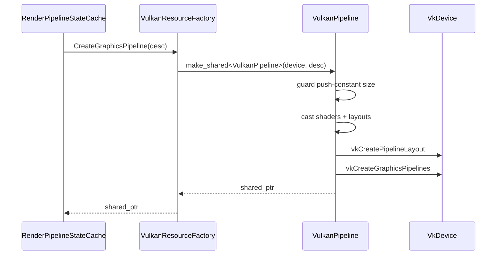

# VulkanPipeline

## 1. Role

Concrete `RHIPipeline` implementation. Creates `VkPipeline`,
`VkPipelineLayout`, and the dynamic rendering info, with a push-constant
guard that rejects oversize blocks at the device limit.

## 2. Source Location

- `Engine/Source/Runtime/RHI/Private/Vulkan/VulkanPipeline.{h,cpp}`

## 3. Owned State

```cpp
VkDevice        m_Device = VK_NULL_HANDLE;
VkPipeline      m_Pipeline = VK_NULL_HANDLE;
VkPipelineLayout m_PipelineLayout = VK_NULL_HANDLE;
VkShaderStageFlags m_PushConstantStages = 0;
```

## 4. Borrowed Dependencies

- The owning `RHIDevice` (held by reference through the base class
  `RHIPipeline`).
- The shader and layout objects passed through `RHIGraphicsPipelineDesc`.

## 5. Lifetime

Constructed and owned (via `shared_ptr<RHIPipeline>`) by
`VulkanResourceFactory::CreateGraphicsPipelineImpl`. Destroyed when
the pipeline falls out of use (cache eviction or renderer shutdown);
the destructor releases both `VkPipeline` and `VkPipelineLayout`.

## 6. Callers and Used By

- `RenderPipelineStateCache` (creates and caches).

## 7. Main Collaborators

- `VulkanCheckedCast` (downcast of shaders / bind group layouts).
- `VulkanUtils` (RHI -> Vulkan conversion helpers).

## 8. Runtime Sequence



## 9. Important Invariants

- Push-constant size is validated against `device.GetCapabilities().MaxPushConstantSize`
  before `vkCreatePipelineLayout`. Failures log and return without
  creating the layout (the pipeline becomes an invalid object that the
  cache will treat as nullptr).
- Vertex input layouts are mirrored exactly between CPU and GPU;
  `desc.VertexLayout.Attributes.size()` controls how many attributes
  Vulkan sees.
- `desc.HasColorAttachment` controls `colorAttachmentCount`. When
  false, the pipeline is depth-only.

## 10. Invalid States and Failure Modes

- `m_Device == VK_NULL_HANDLE` -> early return without creating
  anything.
- Invalid shader / layout -> early return with an error log.
- Push-constant size guard -> early return with an error log.
- `vkCreatePipelineLayout` non-success -> early return with an error
  log; `m_PipelineLayout` stays null.
- `vkCreateGraphicsPipelines` non-success -> log error; `m_Pipeline`
  stays null.

## 11. Threading and Synchronization Assumptions

- All methods are main-thread.

## 12. Design Rationale

- Verbose state construction keeps every struct element readable
  against the Vulkan spec.
- The push-constant guard exists specifically because some drivers
  (notably the Intel Iris Xe Gen 11/12 driver) crash inside
  `vkCreatePipelineLayout` when given a size larger than the spec
  minimum.

## 13. Alternatives and Trade-offs

- Vulkan HPP bindings. Rejected for now for readability.
- A general "pipeline blob" serializer. Deferred.

## 14. Extension Points

- Compute pipelines, ray-tracing pipelines, mesh shaders. The
  current file is graphics-only.
- Pipeline caching (`VkPipelineCache`). Deferred.

## 15. Current Limitations

- The `RenderShaderTypes::ShadowDepthPushConstants` struct is 144 bytes,
  which exceeds the spec minimum (`maxPushConstantsSize`) of 128 bytes
  on some GPUs. The guard catches this and refuses to create the
  pipeline; the recommended fix is to move `LightViewProjection` into
  a Set 0 UBO.

## 16. Source References

- `Engine/Source/Runtime/RHI/Private/Vulkan/VulkanPipeline.cpp`
- `Engine/Source/Runtime/RHI/Private/Vulkan/VulkanPipeline.h`
- `Engine/Source/Runtime/RHI/Private/Vulkan/VulkanResourceFactory.cpp`
- `Engine/Source/Runtime/RHI/Public/XEngine/RHI/RHICapabilities`
- `Engine/Source/Runtime/Renderer/Private/Resources/RenderShaderTypes.h`
